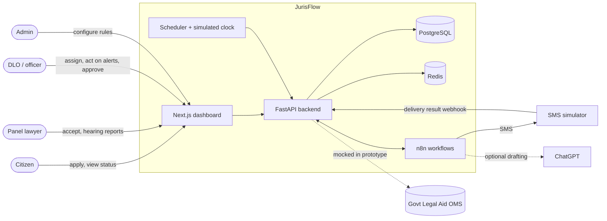
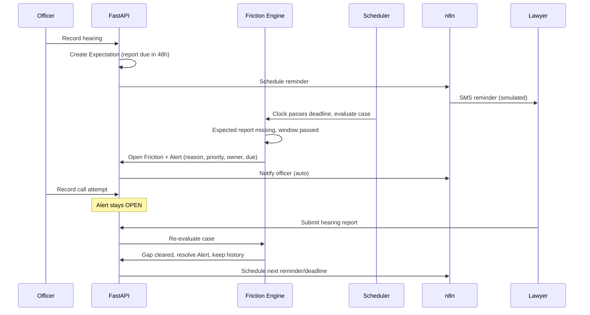
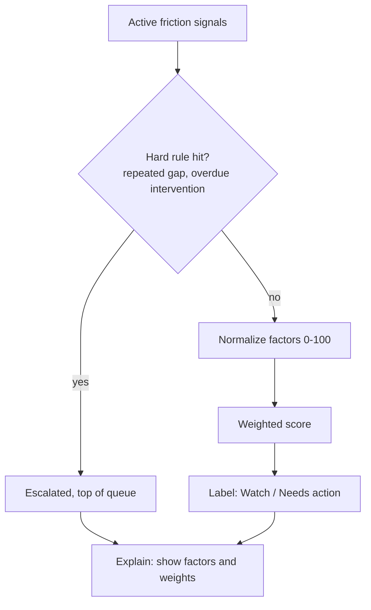
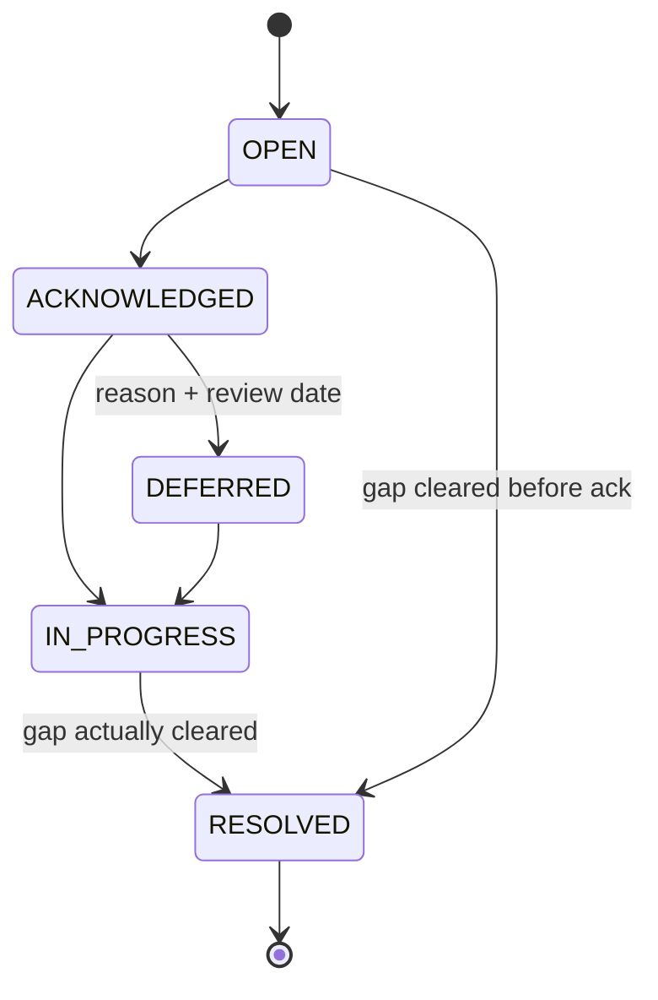
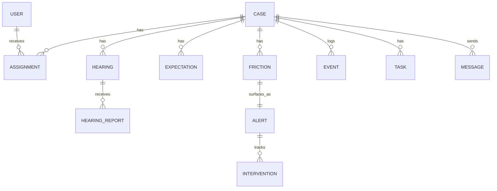

# JurisFlow — Architecture

> Technical design for the prototype. For scope, roles, demo scenarios, acceptance tests and build order, see [`spec.md`](./spec.md).

## 1. The idea (read this first)

After a lawyer is assigned to a legal-aid case, nobody reliably knows whether the expected next step happened. JurisFlow fixes that with one loop:

```
Expect → Observe → Detect gap → Explain → Prioritize → Assign owner → Act → Re-check → Schedule next
```

- Every hearing/task creates an **expectation** (what should happen, by whom, by when).
- When time passes or new information arrives, the **friction engine** compares expected vs observed.
- A gap becomes **one alert** with a reason, priority, owner and due time in the officer's queue.
- The loop closes only when the **specific gap is resolved**, not when a message is sent.

Everything below exists to make this loop work, be explainable, and be safe.

---

## 2. System context



JurisFlow does **not** replace the official case system. It sits on top of case/workflow events (mocked for the prototype) and adds monitoring, friction detection, prioritization and intervention tracking.

---

## 3. Components and ownership

| Component | Owns | Must never |
|---|---|---|
| **FastAPI backend** | All state, rules, friction evaluation, priority, alert lifecycle, RBAC, audit events | Delegate decisions to n8n or an LLM |
| **Friction + Risk module** (inside backend) | `evaluate_case()`, priority labels, reason text | Be split into two services (one module, two responsibilities) |
| **Scheduler** | Ticks on the *simulated clock*, triggers evaluation when deadlines pass | Contain rule logic |
| **n8n** | Triggers, retries, delivery, the human-approval webhook gate | Evaluate friction or change case state on its own |
| **ChatGPT (optional)** | Drafting text, summarizing, explaining precomputed factors | Set priority, state, assignment, payment, discipline, eligibility |
| **PostgreSQL** | Source of truth, append-only events | — |
| **Redis** | Job queue, dedup keys for the evaluator | Hold anything not recoverable from Postgres |
| **Next.js** | Role-based views | Contain business rules |

---

## 4. Stack and layout

| Layer | Choice |
|---|---|
| Frontend | Next.js |
| Backend | FastAPI, Pydantic, SQLAlchemy + Alembic |
| DB / cache | PostgreSQL / Redis |
| Scheduler | APScheduler (reads simulated clock) |
| Automation | n8n (self-hosted, webhooks) |
| LLM | Provider-neutral interface, feature-flagged, off by default |

```
/backend    app/{api,domain,engine,workers,adapters,models}   tests/
/frontend   app/{queue,cases,admin}  components/
/n8n        workflows/*.json
/seed       fixtures.py            # resettable synthetic data
docker-compose.yml                 # frontend, backend, worker, postgres, redis, n8n
```

---

## 5. Core flow: from missed report to resolved alert



---

## 6. Friction engine

**One function, two triggers.** `evaluate_case(case_id)` is called by (a) any new event (report, correction, delivery result, officer action) and (b) the scheduler when a window closes. Same code path, so event-driven and time-driven behaviour never diverge.

**Evaluation per stage (first failure wins):**

```
1. Expected event happened?    no & window open   → no friction yet
                               no & window passed → missing_event
2. Correct actor?              no → wrong_actor
3. Required fields complete?   no → incomplete_data
4. Dependencies satisfied?     no → blocked_dependency
5. All pass → no friction; resolve any open friction for this stage
```

One stage produces at most one friction record, tagged with the earliest failed check.

**Categories** (all eight defined in the data model; prototype implements the first three):

| Category | Condition | Prototype |
|---|---|---|
| Reporting | hearing occurred AND now > date + grace AND no report | ✅ |
| Communication | SMS failed OR (attempts ≥ 3 AND no response) | ✅ |
| Document | required doc missing/pending AND blocks stage | ✅ |
| Scheduling · Capacity · Administrative · Mediation · Citizen-side | defined, not implemented | later |

**Deduplication (one gap = one alert):** Redis key `(case_id, stage_id, category)` plus a unique DB constraint on active frictions. Repeated evaluation must be idempotent.

**Precedence:** a known contact failure takes precedence over "lawyer non-response".

---

## 7. Priority engine

Output is a **label with a reason**: `Watch` · `Needs action` · `Escalated`.



- Prototype uses **rules + weighted score only** and the UI says *"rule-based, not yet calibrated"*.
- Explanations are generated from the same factors that produced the score, never invented separately by an LLM.
- Optional numeric display is a **"follow-up priority index"**, labelled an unvalidated heuristic.
- **Future (not built):** once a friction pattern has n ≥ 30 historical cases, blend in a Bayesian-smoothed rate: `Priority = 0.7 × Weighted + 0.3 × Bayesian`. The 0.7 is a placeholder, not a tuned value.

"Risk" means operational follow-up priority only. It does not mean case-loss probability, negligence or misconduct.

---

## 8. Alert lifecycle



- Only the engine's re-evaluation (gap cleared) or an authorized officer resolves an alert. **A call attempt never does.**
- Every transition is timestamped and attributed.
- Escalation changes the priority label; it does not change the state.

---

## 9. Automation placement rule (n8n + optional ChatGPT)

Ask two questions of any automation:

1. **Needs language generation/summarization of variable content?** No → n8n only. Yes → n8n triggers, ChatGPT drafts.
2. **Citizen-facing, lawyer-facing, or changes case state?** No → auto-deliver. **Yes → mandatory human approval** before n8n sends.

| Automation | Path |
|---|---|
| Deadline reminder SMS | n8n only, auto-send |
| Friction alert to officer dashboard | n8n only, auto-send |
| Escalation letter to lawyer | n8n → ChatGPT drafts → **officer approves** → n8n sends → logged |
| Reassignment, payment, discipline, eligibility | Never automated, human-only |

The "Send" button on a gated draft is an **n8n webhook waiting for human input**. The system works with the LLM disabled (fixed templates).

**Delivery boundary:** a state change and its `Message` outbox row commit in one DB transaction. A worker sends idempotently and records `QUEUED → SENT → DELIVERED | FAILED`. The UI never claims delivery before `DELIVERED`. A failed SMS never rolls back the case; it creates a contact-repair task.

---

## 10. Data model

Timestamps are timezone-aware (`Asia/Dhaka`). `Event` and `HearingReport` are append-only.



Key entities (essential fields only):

```
Case(id, reference, type, status, opened_at, district_id)
User(id, role[citizen|lawyer|dlo|staff|admin], name, phone)
LawyerProfile(user_id, practice_areas[], availability, capacity, active_caseload)
Assignment(id, case_id, lawyer_id, status[offered|accepted|declined|reassigned], conflict_check_done)
Hearing(id, case_id, scheduled_at, status[scheduled|occurred|adjourned|cancelled])
HearingReport(id, hearing_id, attended[yes|no|unknown], outcome, adjournment_reason,
              next_hearing_date?, submitted_at, supersedes_report_id?)
Expectation(id, stage, expected_event, expected_actor_role, window_end, required_fields[],
            depends_on[], rule_id, rule_version, status[pending|met|missed|cancelled])
Friction(id, case_id, category, check_failed, state[OPEN|ACKNOWLEDGED|RESOLVED],
         reason_text, evidence_timestamps[], rule_id, rule_version, opened_at, resolved_at)
Alert(id, friction_id, label[watch|needs_action|escalated], factors_json, owner_id,
      due_at, state, deferral_reason?, review_date?)
Intervention(id, alert_id, officer_id, action, note, created_at)
Task(id, case_id, kind[date_check|contact_repair|callback], owner_id, due_at, status)
Message(id, case_id, template, status[QUEUED|SENT|DELIVERED|FAILED], idempotency_key,
        requires_approval, approved_by?, simulated)
Event(id, case_id, type, actor_id, payload, occurred_at, supersedes_event_id?)   # audit log
RuleConfig(rule_id, version, params_json)      # grace period, overdue count, adjournment count
SimClock(now)
```

Modelling rules:
- `attended` and `outcome` are separate fields; attendance is self-reported unless verified.
- Corrections append a superseding record; nothing is overwritten or deleted.
- Every alert stores its rule id + version.

---

## 11. API surface

| Endpoint | Purpose |
|---|---|
| `POST /cases` | Create case (web form or walk-in) |
| `POST /cases/{id}/assignments` · `POST /assignments/{id}/accept` | Assign and accept |
| `POST /hearings` · `POST /hearings/{id}/reports` | Record hearing, submit report (idempotency key) |
| `GET /officer/queue` | Prioritized open alerts |
| `POST /alerts/{id}/transition` · `POST /alerts/{id}/interventions` | Move state, record action |
| `GET /cases/{id}/timeline` | Append-only history |
| `POST /messages/{id}/approve` | Officer approves a gated draft |
| `POST /webhooks/sms-status` | Delivery result from simulator |
| `GET/PUT /admin/rules` | Versioned thresholds |
| `POST /sim/clock` | Advance simulated clock and trigger sweep |

All endpoints enforce role- and case-scoped RBAC server-side.

---

## 12. Key decisions

| Decision | Why |
|---|---|
| Rules + weighted score, not an ML/LLM risk score | Must be explainable and auditable in a justice setting; too little data to validate a model |
| Friction and risk are one module | Two responsibilities, no need for two services in an MVP |
| Backend owns all logic; n8n only orchestrates | Keeps decisions testable and auditable; makes the approval gate architectural, not a promise |
| Single `evaluate_case()` for both triggers | Prevents drift between event-driven and scheduled behaviour |
| Append-only events, derived state | Full audit trail; corrections never destroy history |
| One gap = one alert (dedup key + DB constraint) | Prevents alert fatigue |
| Simulated clock | Lets the demo show deadlines passing on demand |
| Outbox for messages | Delivery failures cannot corrupt case state |
| LLM is optional and feature-flagged | The system's decisions must not depend on it |

---

## 13. Cross-cutting concerns

- **Security:** seeded role accounts, server-side RBAC on every endpoint, no secrets in code. Production identity/hosting is out of scope.
- **Audit:** every state change writes an `Event` (who, what, when, rule id + version).
- **Errors:** external calls (SMS, LLM) fail soft: outbox retries with backoff, LLM falls back to fixed templates.
- **Config:** thresholds live in versioned `RuleConfig`, never hardcoded.
- **Privacy:** synthetic data only; citizen-facing SMS wording stays neutral (phones may be shared).
- **Labelling:** simulated SMS, clock and payments are visibly marked in the UI.

---

## 14. Prototype simplifications

| Prototype | Production (later) |
|---|---|
| DLO picks from a filtered lawyer list | Ranked shortlist by workload, practice area, availability, conflict check |
| SMS simulator | Validated two-way SMS provider |
| Mocked OMS / court data | Authorized integration |
| 3 friction categories | All 8 |
| Weighted score only | Bayesian blend once n ≥ 30 |
| Seeded accounts | Real identity |
