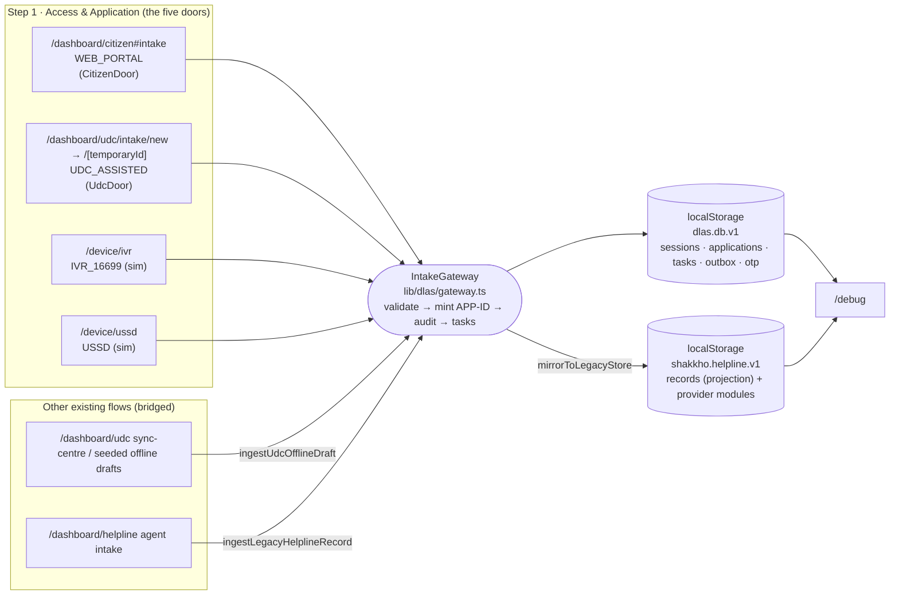

# DLAS Data Contracts — "Five Doors, One Record"

**Status:** Step 1 (Access & Application) implemented. Canonical code: `frontend/lib/dlas/`.
**Storage:** browser `localStorage` (prototype backend). No server. Everything below is JSON.

This file answers two questions for the team:

1. **Which JSON lives where?** (storage keys → collections)
2. **Which route (endpoint) reads/writes which JSON?**

---

## 1. Storage map



| Key | Kind | Owner | Holds |
|---|---|---|---|
| `dlas.db.v1` | localStorage | `lib/dlas/store.ts` | **Canonical shared record** — `DlasDb` (see §2) |
| `dlas.active.<CHANNEL>` | localStorage | `lib/dlas/door-bridges.ts`, `components/dlas/shared.tsx` | id of the in-progress session per door (save/resume) |
| `dlas.node.<SES-ID>` | localStorage | `components/dlas/scripted-phone.tsx` | current IVR/USSD menu node (resume a call) |
| `shakkho.helpline.v1` | localStorage | `lib/shakkho/persistence.ts` | Legacy `StoreEnvelope` used by helpline, DLAO, referral, lawyer pages. New applications appear in `records[]` as read-only projections with the same `applicationId`. |
| `shakkho.dlao.inbox.v1` | localStorage | `lib/shakkho/bridges/dlao-inbox.bridge.ts` | legacy DLAO inbox tasks |
| `shakkho.referrals.inbox.v1` | localStorage | `lib/shakkho/bridges/referral-inbox.bridge.ts` | legacy referral inbox |
| `shakkho.udc.v1` | IndexedDB | `lib/shakkho/services/offline-store.service.ts` | legacy UDC offline drafts |
| `dlas.files.v1` | localStorage | `lib/dlas/files.ts` | officer-viewable copies of uploaded documents, keyed by `docId` (images ≤1200px JPEG, PDFs ≤450 KB); `DocumentRef.preview` says `STORED` / `TOO_LARGE` / `NONE` |
| `rjd.intake.drafts` / `rjd.intake.pending` | localStorage | `lib/intake-store.ts` | citizen wizard's own draft + offline queue (the wizard also writes `dlas.db.v1` at every step) |
| `shakkho.lang`, `shakkho.udc.sidebar.v1` | localStorage | UI | language, sidebar state |

> ⚠ localStorage is **per browser**. A citizen on a phone and an officer on a laptop do **not** share it.
> To move state between devices for the demo use **/debug → Export JSON / Import JSON**.

---

## 2. `dlas.db.v1` — the whole database

```jsonc
{
  "v": 1,
  "schemaVersion": "dlas.application.v1",
  "counters": { "application": 5, "case": 0, "auditSeq": 212 },
  "udcCentres":   [ /* UdcCentre — { centreId, name{bn,en}, area{bn,en}, district, hours, services[], source DEMO_DIRECTORY|REGISTERED_OPERATOR, operatorId } — 2 demo centres per district + every signed-up UDC operator */ ],
  "officers":     [ /* DlaoOfficerAccount — { officerId OFC-XXXXXX, name, phone, officeType DLAO|SCLAC|LLAC, district, audit[] } */ ],
  "eligibilityRulesets": [ /* { version "LASP-2014-working-v1", status WORKING_DRAFT, incomeThresholdAnnualBdt{SUPREME_COURT,OTHER_COURTS}, exemptCategories[] } */ ],
  "udcOperators": [ /* UdcOperatorAccount — { operatorId UDC-XXXXXX, name, phone, centre, district, createdAt, lastLoginAt, audit[] } */ ],
  "citizens":     [ /* CitizenAccount — { citizenId, name, phone, createdAt, lastLoginAt, notificationsReadAt, audit[] } */ ],
  "sessions":     [ /* IntakeSession — one per attempt at any door (pre-submission) */ ],
  "applications": [ /* ApplicationRecord — the shared record, one per Application ID */ ],
  "tasks":        [ /* Task — human work created by the workflow */ ],
  "outbox":       [ /* SimMessage — simulated SMS (OTP, confirmations, suppressed) */ ],
  "otp":          [ /* OtpChallenge — demo OTP codes */ ],
  "updatedAt": "2026-09-23T07:10:00.000Z"
}
```

### 2.1 `ApplicationRecord` (identical shape from every door)

```jsonc
{
  "schemaVersion": "dlas.application.v1",
  "applicationId": "APP-2026-30002",        // minted ONLY by IntakeGateway.submit
  "caseId": null,                            // set only after human acceptance (Step 2)
  "status": "SUBMITTED",                     // SUBMITTED|UNDER_REVIEW|INFO_REQUESTED|ACCEPTED|REJECTED|WITHDRAWN|CLOSED
  "stage": "ACCESS_APPLICATION",             // backbone stage (see §4)
  "channel": {
    "code": "IVR_16699",                     // WEB_PORTAL|MOBILE_APP|IVR_16699|USSD|UDC_ASSISTED|HELPLINE_AGENT
    "captureMethod": "IVR_DTMF",
    "sessionId": "SES-K3P9QZ",
    "entryPoint": "tel:16699",
    "simulated": true,                       // telephone/USSD network is simulated; workflow is real
    "clientRef": null                        // offline temp id / legacy id → idempotency
  },
  "identity": { "phone": "01711000001", "method": "CALLER_LINE_ID", "verified": true, "verifiedAt": "…", "otpAttempts": 0 },
  "data": {
    "applicant": {
      "fullName": "Moyuri Akter", "phone": "01799000111", "phoneOwnedByApplicant": null,
      "gender": "FEMALE", "district": "JOYPURHAT", "addressLine": null,
      "preferredLanguage": "bn", "canRead": null, "accessibilityNeeds": []
    },
    "filedBy": { "kind": "REPRESENTATIVE", "name": "Ripon Hossain", "phone": "01711000001",
                 "relation": "SIBLING", "operatorId": null, "centre": null },
    "matter": { "category": "FAMILY", "summary": "…", "summaryOriginal": null, "translation": null,
                "incidentDate": null, "opposingParty": null },
    "urgency": { "selfReportedUrgent": false, "flags": [] },
    "safeContact": { "method": "VIA_REPRESENTATIVE", "phone": "01711000001", "safeTime": "EVENING",
                     "smsAllowed": false, "voicemailAllowed": false, "neutralWordingRequired": true,
                     "notes": null, "window": null /* or { "day": "FRI", "time": "10:30" } */ },
    "documents": [
      { "docId": "DOC-7Q2M1A", "type": "NID", "status": "WILL_SUBMIT_LATER", "fileName": null,
        "mimeType": null, "sizeBytes": null, "sha256": null, "sensitive": false, "qualityNote": null }
    ],
    "consent": { "dataProcessing": true, "contactOnSafeChannel": true, "shareWithAssignedProviders": true,
                 "method": "IVR_DTMF_1", "readBackConfirmed": true, "noticeVersion": "CONSENT-NOTICE-v1", "recordedAt": "…" },
    "freeServiceNoticeAcknowledged": true
  },
  "provenance": {                           // EVERY captured field, keyed by dotted path
    "applicant.fullName": { "source": "REPRESENTATIVE_REPORTED", "method": "IVR_DTMF", "confidence": "STATED",
                            "by": "rep:01711000001", "at": "…", "note": "read back to representative" },
    "applicant.phone":    { "source": "REPRESENTATIVE_REPORTED", "method": "IVR_DTMF", "confidence": "STATED", "by": "rep:01711000001", "at": "…" },
    "routing.office":     { "source": "SYSTEM_DERIVED", "method": "SYSTEM", "confidence": "STATED", "by": "system", "at": "…" }
  },
  "validation": { "valid": true, "missing": [], "errors": [],
                  "warnings": [{ "path": "filedBy", "code": "APPLICANT_CONFIRMATION_PENDING", "message": "…" }] },
  "routing": { "office": "DLAO-JOYPURHAT", "recommendedPriority": "NORMAL", "reasons": ["No urgency signals"],
               "advisoryOnly": true, "humanDecision": null },
  "taskIds": ["TSK-A1B2C3", "TSK-D4E5F6", "TSK-G7H8I9"],
  "audit": [ { "seq": 41, "at": "…", "actor": "system", "role": "system", "action": "session.started", "detail": {} } ],
  "version": 1, "createdAt": "…", "submittedAt": "…", "updatedAt": "…"
}
```

**Provenance sources** — the jury must be able to tell these apart:

| source | meaning | typical door |
|---|---|---|
| `APPLICANT_STATED` | applicant typed/pressed it, not yet read back | Web, USSD |
| `APPLICANT_CONFIRMED` | applicant confirmed after read-back | all (review step / "press 1 if correct") |
| `REPRESENTATIVE_REPORTED` | said by a representative (Ripon for Moyuri) — never upgraded to applicant-confirmed | Web (rep), IVR, USSD |
| `OPERATOR_ENTERED` | UDC/helpline typed it for the applicant | UDC, helpline |
| `AI_INFERRED` | speech-to-text output before confirmation | IVR voice answers |
| `SYSTEM_DERIVED` | platform-computed (caller-line id, office routing, checklist) | all |

A UDC translation stays `OPERATOR_ENTERED` (`matter.summary`); only the applicant's own words (`matter.summaryOriginal`) become `APPLICANT_CONFIRMED`.

### 2.2 `IntakeSession` (what /debug shows before submission)

```jsonc
{
  "sessionId": "SES-K3P9QZ", "channel": "USSD", "entryPoint": "*16699#", "simulated": true,
  "step": "DETAILS_CAPTURED",               // STARTED → IDENTITY_VERIFIED → DETAILS_CAPTURED → DOCUMENTS_ATTACHED → REVIEWED → SUBMITTED | ABANDONED
  "stepHistory": [{ "step": "STARTED", "at": "…" }, { "step": "IDENTITY_VERIFIED", "at": "…" }],
  "identity": { "phone": "01811000002", "method": "NETWORK_MSISDN", "verified": true, "verifiedAt": "…", "otpAttempts": 0 },
  "meta": { "msisdn": "01811000002", "lang": "en" },   // UDC: operatorId, centre · IVR: callerId
  "draft": { /* ApplicationData — same shape as record.data, filled progressively */ },
  "provenance": { /* same as record.provenance */ },
  "transcript": [ { "at": "…", "from": "SYSTEM", "text": "Which district?\n1. Dhaka …", "nodeId": "DISTRICT" },
                  { "at": "…", "from": "USER", "text": "2", "nodeId": "DISTRICT" } ],
  "applicationId": null,                   // set on submit
  "lastValidation": null,
  "audit": [ /* session-level audit; copied onto the record at submit */ ],
  "createdAt": "…", "updatedAt": "…"
}
```

### 2.3 `Task`

```jsonc
{ "taskId": "TSK-A1B2C3", "type": "ELIGIBILITY_REVIEW",   // ELIGIBILITY_REVIEW|URGENT_SAFETY_REVIEW|COMPLETE_MISSING_INFO|DOCUMENT_FOLLOW_UP|HUMAN_CALLBACK
  "applicationId": "APP-2026-30002", "sessionId": "SES-K3P9QZ",
  "assignedRole": "DLAO", "office": "DLAO-JOYPURHAT", "status": "OPEN", "priority": "NORMAL",
  "reason": "New application — eligibility decision by authorised officer",
  "dueAt": "…", "createdAt": "…", "context": {} }
```

Tasks created at submit: always `ELIGIBILITY_REVIEW`; `URGENT_SAFETY_REVIEW` if urgency flags; `COMPLETE_MISSING_INFO` if a legacy flow submitted incomplete data; `DOCUMENT_FOLLOW_UP` if documents are pending; `HUMAN_CALLBACK` (helpline) if a representative filed. IVR "0" / USSD "0" creates a `HUMAN_CALLBACK` without an application.

### 2.4 `SimMessage` and `OtpChallenge`

```jsonc
{ "msgId": "SMS-2KD9QX", "kind": "SMS_CONFIRMATION", "to": "01712345678",
  "body": "Your reference number is APP-2026-30001. Keep it safe.",   // neutral wording by default
  "sessionId": "SES-…", "applicationId": "APP-2026-30001", "simulated": true,
  "status": "SUPPRESSED_UNSAFE",           // DELIVERED | SUPPRESSED_UNSAFE (applicant refused SMS)
  "at": "…" }
{ "sessionId": "SES-…", "phone": "01712345678", "code": "481203", "expiresAt": "…", "consumed": true }
```

---

## 3. Door → JSON mapping (same fields, different capture)

| Field | Citizen wizard (`/dashboard/citizen#intake`) | IVR (`/device/ivr`, sim) | USSD (`/device/ussd`, sim) | UDC (`/dashboard/udc/intake/*`) |
|---|---|---|---|---|
| identity | SMS OTP on step 1 (`SMS_OTP`) | caller-line id (`CALLER_LINE_ID`) | SIM MSISDN (`NETWORK_MSISDN`) | `OPERATOR_ATTESTED` (applicant present) |
| filedBy.kind | self → SELF; family/neighbour → REPRESENTATIVE | SELF / REPRESENTATIVE (menu 1/2) | SELF / REPRESENTATIVE | UDC_OPERATOR (+ operatorId, centre) |
| applicant.fullName | "your name" (self) or "their name" (rep) | voice → `AI_INFERRED` → read-back | typed | typed by operator; interpreter-recorded name |
| applicant.district | district select (step 1) | keypad 1–8 | menu 1–8 | district select |
| matter.category | 6 matter cards → canonical code | keypad 1–8 | menu 1–8 | matter select → canonical code |
| matter.summary | description (step 3) | voice → read-back | ≤160 chars | Bangla translation + `summaryOriginal` (applicant's words) |
| matter.opposingParty | party name + address | — | — | — |
| urgency.flags | — | "in danger? 1/2" | "in danger? 1/2" | — |
| safeContact.* | "any time" or day + time → safeTime + window; phone; special instructions → notes | menu + keypad | menu + digits | contact route + safe time select |
| documents | uploads (sha256) + checklist → WILL_SUBMIT_LATER | checklist → WILL_SUBMIT_LATER | checklist → WILL_SUBMIT_LATER | camera captures (quality findings → qualityNote) + checklist |
| consent.method | `WEB_CHECKBOX` | `IVR_DTMF_1` | `USSD_OPTION_1` | `UDC_VERBAL_READBACK` (8 consent topics) |

Matter mapping (citizen/UDC legacy codes → canonical): family→FAMILY, land→LAND, civil→CIVIL_MONEY, criminal→CRIMINAL_DEFENCE, labour→LABOUR, other→OTHER.
Citizen safe contact: "Any time" → `safeTime: ANYTIME`; or a specific day + time → `safeContact.window = { day, time }` and `safeTime` = MORNING (<12:00) / AFTERNOON (<16:00) / EVENING.
UDC submit never blocks on gaps (applicant may have travelled far): missing fields become a `COMPLETE_MISSING_INFO` task. Citizen, IVR and USSD submit only when valid.

All district/matter/safe-time lists come from `lib/dlas/reference.ts` (keypad digit = list index + 1), so IVR "2", USSD "2" and the citizen/UDC "Joypurhat" option all store `"JOYPURHAT"`.
All doors call one validator: `lib/dlas/validate.ts`.

Required for a valid submit (every door): `identity.verified`, `applicant.fullName`, `applicant.phone` (optional when a representative files — contact then goes through them), `applicant.district`, `matter.category`, `matter.summary` (≥10 chars), `safeContact.method`, `safeContact.safeTime`, `safeContact.phone` (if CALL/SMS), `consent.dataProcessing`, `consent.method`. Representative: `filedBy.name/relation/phone`. UDC: `filedBy.operatorId`, `freeServiceNoticeAcknowledged`, `consent.readBackConfirmed`.

---

## 4. Backbone stages (from the case document)

```
ENTRY CHANNEL → APPLICATION ID → VERIFICATION / REVIEW → CASE ID → MEDIATION / LAWYER / REFERRAL → FOLLOW-UP → OUTCOME → CLOSURE
stage:  ACCESS_APPLICATION → VERIFICATION_REVIEW → CASE_OPENED → SERVICE_DELIVERY → FOLLOW_UP → OUTCOME → CLOSURE
```

Step 1 ends at `ACCESS_APPLICATION` + `status: SUBMITTED` + open `ELIGIBILITY_REVIEW` task. Step 2 (DLAO review) will move `stage` and set `routing.humanDecision` / `caseId` — by an authorised human only.

---

## 5. Route map (all endpoints) → JSON they use

| Route | Role | Reads / writes |
|---|---|---|
| `/portal/udc` | UDC sign-in | **Sign up** (name + mobile + UDC centre + district) / **Log in** (mobile only) → `dlas.db.v1.udcOperators`, current id in `dlas.udc.current`; every assisted record carries `filedBy.operatorId` |
| `/dlo` | DLAO / SCLAC / LLAC sign-in | **Sign up** (name + mobile + office + district) / **Log in** (mobile only) → `dlas.db.v1.officers`, current id in `dlas.dlao.current` |
| `/dashboard/dlo` (`#new` `#review` `#decided` `#tasks` `#app/<APP-ID>`) | officer | **Step 2** — office queue + review workspace; writes `applications[].review`, `status`, `stage`, `caseId`, `closedAt`, `tasks`, `outbox`, `audit` via `DlaoReviewService` (`lib/dlas/dlao.ts`) |
| `/` | citizen sign-in | **Sign up** (name + mobile) / **Log in** (mobile only) → `dlas.db.v1.citizens`, current id in `dlas.citizen.current` |
| `/dashboard/citizen#intake` (alias `#complaint`) | citizen / representative | **"Lodge a complaint"** — the 5-step wizard (the separate old complaint form was removed as redundant); **writes** `dlas.db.v1` at every step via `CitizenDoor` (OTP, district, draft, submit → APP-ID); also its own `rjd.intake.*` |
| `/dashboard/udc/intake/new` → `/dashboard/udc/intake/[temporaryId]` | UDC | existing new-intake + workspace; **writes** `dlas.db.v1` via `UdcDoor` (start, consents, translation, documents, submit) before the offline queue, which then reuses the same APP-ID |
| `/device`, `/device/ivr`, `/device/ussd` | caller on 16699 / basic phone | IVR & USSD simulators; **write** `dlas.db.v1` through the shared script `lib/dlas/scripted-flow.ts` |
| `/debug` | team / jury | **reads** `dlas.db.v1` (+ any localStorage key); export / import / reset |
| `/`, `/dlo`, `/lawyer`, `/admin`, `/portal/[role]` | sign-in portals | — |
| `/dashboard/[role]`, `/dashboard/{citizen,dlo,lawyer,admin}` | role dashboards | `lib/case-demo.ts` (static demo), legacy envelope |
| `/dashboard/helpline`, `/dashboard/helpline/records/[applicationId]`, `/dashboard/helpline/agent[/handoffId]` | 16699 agent | `shakkho.helpline.v1`: records, sessions, representations, verifications, handoffs, communications, audit, humanIntakes, safeContactPlans. Agent submit → **canonical ID via gateway** |
| `/helpline/calls/[sessionId]`, `/helpline/accessibility/ripon-status`, `/voice-status/[caseId]` | Ripon / voice status | `shakkho.helpline.v1`: sessions, voiceStatusSessions |
| `/dashboard/udc/**` (consent, documents, offline-queue, sync-centre, history, performance, jury-mode, status-visit, letter-access, device-and-cache, clarification-tasks, applications) | UDC | IndexedDB `shakkho.udc.v1` (offlineDrafts) + `shakkho.helpline.v1` (assistedIntakes, idMappings, syncConflicts, integrityVerifications). Offline sync → **canonical ID via gateway** |
| `/demo/nuching-offline-flow`, `/case-support/offline-origin`, `/case-support/sync-conflicts` | case support | same UDC/offline collections |
| `/dashboard/dlao/applications/[applicationId]` | DLAO | `shakkho.helpline.v1`: records, dlaoVerifications, dlaoTaskItems |
| `/referrals/**`, `/cases/[caseId]/referrals`, `/citizen/referrals/[recordId]`, `/applications/[applicationId]/sensitive-review` | DLAO / receiving DLAO | `shakkho.helpline.v1`: referrals, sensitiveEvidence, authorityDirectory, legalBasis, routingRecommendations, deliveryOperations, escalationTasks, citizenSafeStatuses; `shakkho.referrals.inbox.v1` |
| `/dlao/**` (lawyers, assignments, reassignments, inactivity-reviews, overdue-lawyer-updates, lawyer-change-requests, payment-reconciliation) | DLAO | `shakkho.helpline.v1`: panelLawyers, lawyerAssignments, caseHearings, caseProgressUpdates, requiredUpdates, lawyerChangeRequests, reassignments, inactivityPatterns, paymentReconciliations … |
| `/lawyer/**` | panel lawyer | same lawyer collections |
| `/citizen/cases/[caseId]/{status,lawyer-change}` | citizen | lawyer + status collections |
| `/admin/{authority-directory,legal-basis-registry,fee-schedules,update-requirements}` | admin | registry collections in `shakkho.helpline.v1` |
| `/sim/[[...tool]]` | demo controls | local component state only |
| `/verify/[certNumber]` | public verify | static |

Next steps move each provider module onto `dlas.db.v1` in the order of the backbone (DLAO review → case ID → mediation / lawyer / referral), reusing `IntakeGateway`-style services so everything stays one record.


---

## 6. Step 2 — Verification & eligibility (`record.review`)

```
Application received by relevant office      receive()            SUBMITTED → UNDER_REVIEW, stage VERIFICATION_REVIEW
Verify identity & NID                        checkNidRegistry()   SIMULATED — format check only (10/13/17 digits), labelled on the record
                                             verifyIdentity()     + nid: MATCHES_DOCUMENT | MISMATCH | NOT_PROVIDED (MISMATCH blocks; CONFIRMED+MISMATCH refused)
                                                                  CONFIRMED | CORRECTED (→ OFFICER_VERIFIED provenance) | DISPUTED | UNREACHABLE (→ BLOCKED, INFO_REQUESTED, HUMAN_CALLBACK task)
Verify documents & facts                     reviewFacts()        SUFFICIENT (→ review.verifiedAt, audit application.verified = VERIFIED) | NEEDS_CLARIFICATION | INSUFFICIENT (→ BLOCKED, COMPLETE_MISSING_INFO task)
                                             markDocumentReceived(), setDocumentType() (officer re-classifies an upload → OFFICER_VERIFIED provenance)
Vulnerability & eligibility (advisory)       assessEligibility()  recommendation from the JSON ruleset — exempt category first, then income band
Eligible for legal aid?  (HUMAN)             decide()             reason ≥ 10 chars, always
   Yes → Case ID DLAS-YYYY-NNNNN, status ACCEPTED, stage CASE_OPENED, applicant notified (SMS rules apply)
   No  → status REJECTED, stage CLOSURE, closedAt, all tasks closed, applicant notified
Where to send? (HUMAN, accepted cases only)  choosePathway()      GRAM_ADALAT | MEDIATION | LAWYER, reason ≥ 10 chars; recommendPathway() is advisory
   → stage SERVICE_DELIVERY, task GRAM_ADALAT_REFERRAL (GRAM_ADALAT) | MEDIATION_SCHEDULING (MEDIATOR) | LAWYER_ASSIGNMENT (DLAO), applicant notified
Record eligibility details and notes         addNote()
```

**Something missing or disputed** (`reviewFacts` → INSUFFICIENT / NEEDS_CLARIFICATION): the applicant is told **automatically** — a dashboard notification (from the open `COMPLETE_MISSING_INFO` task) plus a simulated SMS through the safe-contact rules (neutral wording / SMS-off respected; audit `applicant.info_requested`). With `requestCall: true` the officer also opens a `HUMAN_CALLBACK` task for the helpline at the applicant's safe time. Identity `UNREACHABLE` likewise sends an automatic "we tried to reach you" SMS and opens a call-back task.

An application shows **UNVERIFIED** until `review.verifiedAt` is set, i.e. the officer has checked identity + NID and the documents and case facts.

```jsonc
"review": {
  "officerId": "OFC-7K2M9Q", "officerName": "…", "office": "DLAO-JHENAIDAH", "receivedAt": "…",
  "identity":    { "state": "COMPLETED", "outcome": "CORRECTED", "method": "PHONE_CALL", "note": "…",
                   "corrections": [{ "path": "applicant.nidNumber", "from": "1234567890", "to": "1234567891" }], "attempts": 2, "at": "…",
                   "nid": { "status": "MATCHES_DOCUMENT", "formatValid": true,
                            "simulatedRegistryCheck": { "at": "…", "result": "FORMAT_OK", "note": "Simulated — … only the number format was checked" } } },
  "facts":       { "state": "COMPLETED", "items": [{ "key": "matter.summary", "label": "…", "value": "…", "status": "CORROBORATED", "note": null }],
                   "missingEvidence": [], "outcome": "SUFFICIENT", "at": "…" },
  "eligibility": { "state": "COMPLETED", "rulesetVersion": "LASP-2014-working-v1", "courtLevel": "OTHER_COURTS",
                   "declaredAnnualIncomeBdt": 250000, "incomeBand": "ABOVE_THRESHOLD", "exemptCategories": ["WOMEN_CHILD_OPPRESSION"],
                   "vulnerabilityNotes": "…", "recommendation": "ELIGIBLE_EXEMPT_CATEGORY", "reasons": ["…"], "advisoryOnly": true, "at": "…" },
  "decision":    { "decision": "ELIGIBLE", "reason": "…", "followedRecommendation": true, "by": "OFC-…", "byName": "…", "at": "…" },
  "notes":       [{ "at": "…", "by": "OFC-…", "byName": "…", "text": "…" }],
  "verifiedAt":  "…",
  "pathway":     { "type": "MEDIATION", "recommended": "MEDIATION", "recommendationReasons": ["…"], "followedRecommendation": true,
                   "reason": "…", "by": "OFC-…", "byName": "…", "at": "…" }
}
```

Officer scope: DLAO sees its district, LLAC sees labour matters of its district, SCLAC sees all.
The eligibility ruleset is a **working draft** stored in the JSON; correct it there (new version) after checking the Legal Aid Services Policy text — the UI always shows the version used.

## 7. Step 3 — Panel lawyer (`/lawyer` sign-in, `/dashboard/lawyer`)

Accounts: `db.lawyers[]` — `{ lawyerId: "LAW-XXXXXX", name, phone (login), district (panel), barEnrolmentNo, practiceAreas[], audit[] }`; session key `dlas.lawyer.current`.
Rules (editable JSON, written on first use): `db.lawyerRules` — `{ version, offerResponseHours: 48, updateDueHours: 48, missedHearingsBeforeReassign: 2, patternCases: 3, patternWindowDays: 90, maxActiveCases: 10, feeBasis }`.

```
DLAO chooses pathway LAWYER (Step 2)            → task LAWYER_ASSIGNMENT (DLAO)
Engine suggests lawyers (ADVISORY)               suggestLawyers(): district panel ranked by specialisation, availability (active cases vs maxActiveCases), recent missed hearings; previous lawyers on the case ranked last
DLAO offers the case                             DlaoLawyerService.assign()  → assignment OFFERED, LAWYER_RESPONSE task for the lawyer, SMS to lawyer (simulated); audit records the engine rank
Lawyer accepts                                   LawyerService.accept()      → ACCEPTED, access grant FULL_CASE_RECORD, client told (safe-contact rules); on a reassignment the upcoming hearings move to the new lawyer
Lawyer declines (reason) / no answer in 48 h     decline() / sweep           → DLAO task LAWYER_ASSIGNMENT / LAWYER_UPDATE_OVERDUE (OFFER_RESPONSE) — assign another
Lawyer records a hearing                         addHearing()                → hearing (assignmentId = responsible lawyer), HEARING_UPDATE_DUE (due = hearing + 48 h)
Lawyer reports                                   submitUpdate()              → hearing.result ATTENDED | MISSED (did not attend) | NOT_HELD; provenance LAWYER_REPORTED
No report by the deadline                        sweep                       → hearing counts as MISSED, DLAO alert LAWYER_UPDATE_OVERDUE (no chase call), reminder SMS to the lawyer
Missed ≥ missedHearingsBeforeReassign on a case  submitUpdate() / sweep      → DLAO task LAWYER_REASSIGN_REVIEW "assign another lawyer" (human decision)
DLAO reassigns                                   DlaoLawyerService.withdraw()→ WITHDRAWN, old lawyer's access revoked, payment frozen PENDING_CASE_COMPLETION, new LAWYER_ASSIGNMENT task
Missed hearings on ≥ patternCases cases (90 d)   sweep                       → separate LAWYER_INACTIVITY_REVIEW (T1 pattern — review only, not a finding)
DLAO completes representation                    DlaoLawyerService.complete()→ stage OUTCOME; every assignment's payment → DLAO_REVIEW with the attended-hearing count
```

```jsonc
"lawyer": {
  "assignments": [{ "assignmentId": "ASN-…", "lawyerId": "LAW-…", "lawyerName": "…", "status": "OFFERED|ACCEPTED|DECLINED|WITHDRAWN|COMPLETED",
                    "offeredAt": "…", "offeredBy": "OFC-…", "offeredByName": "…", "note": "…", "respondBy": "…", "respondedAt": "…",
                    "declineReason": null, "responseOverdueFlaggedAt": null, "handoverFrom": "ASN-… (previous)", "reassignFlaggedAt": null,
                    "ledger":  { "hearingsAttended": 1, "hearingsMissed": 2, "hearingsNotHeld": 0, "hearingsUnreported": 0, "updatesOnTime": 0, "updatesLate": 2, "updatedAt": "…" },
                    "payment": { "status": "ACCRUING|PENDING_CASE_COMPLETION|DLAO_REVIEW", "payableHearings": 1,
                                 "completedStages": [{ "hearingId": "HRG-…", "at": "…", "result": "ATTENDED" }],
                                 "missedHearings": 2, "eligibleAmount": "DEMO_RATE", "note": "…", "at": "…" } }],
  "hearings":    [{ "hearingId": "HRG-…", "assignmentId": "ASN-…", "result": "ATTENDED|MISSED|NOT_HELD|null", "at": "…", "court": "…",
                    "purpose": null, "addedBy": "LAW-…", "addedAt": "…", "updateDueAt": "…", "updateId": null, "overdueFlaggedAt": null, "clientNotifiedAt": null }],
  "updates":     [{ "updateId": "UPD-…", "hearingId": "HRG-…", "attendance": "ATTENDED|NOT_ATTENDED|NOT_HELD",
                    "outcome": "ADJOURNED|HEARD|ORDER_PASSED|JUDGMENT|SETTLED|OTHER", "nextDate": null, "note": "…", "by": "LAW-…", "byName": "…", "at": "…", "late": false }],
  "access":      [{ "lawyerId": "LAW-…", "lawyerName": "…", "assignmentId": "ASN-…", "scope": "FULL_CASE_RECORD", "grantedAt": "…", "revokedAt": null, "revokeReason": null }],
  "completion":  { "outcome": "JUDGMENT|SETTLED|WITHDRAWN_BY_CLIENT|OTHER", "reason": "…", "by": "OFC-…", "byName": "…", "at": "…" }
}
```

Access: an offered lawyer sees only the case summary and the officer's note; the full record (client, safe-contact rules, documents, all earlier hearings and reports) opens only while an access grant is active, and every lawyer action checks it. A new lawyer sees the previous lawyer's hearings read-only and cannot report on them.
The deadline sweep runs while the DLAO or lawyer workspace is open (on every record change and once a minute) and writes only on new alerts. The citizen sees "Panel lawyer assigned" (each lawyer), each hearing date, and — before travelling — "No lawyer report for the … hearing" when a report is overdue (A5).
