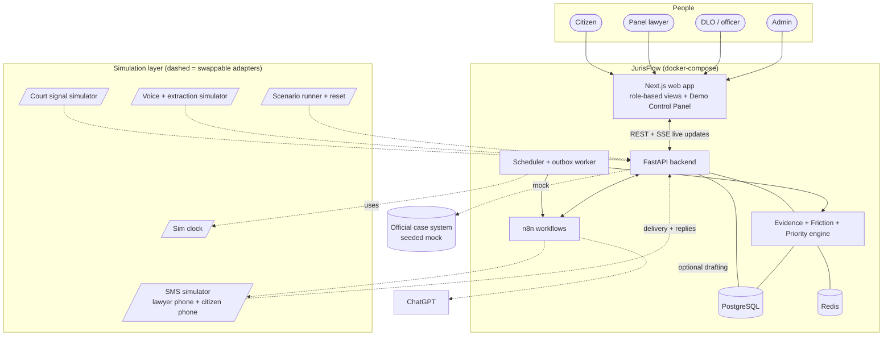
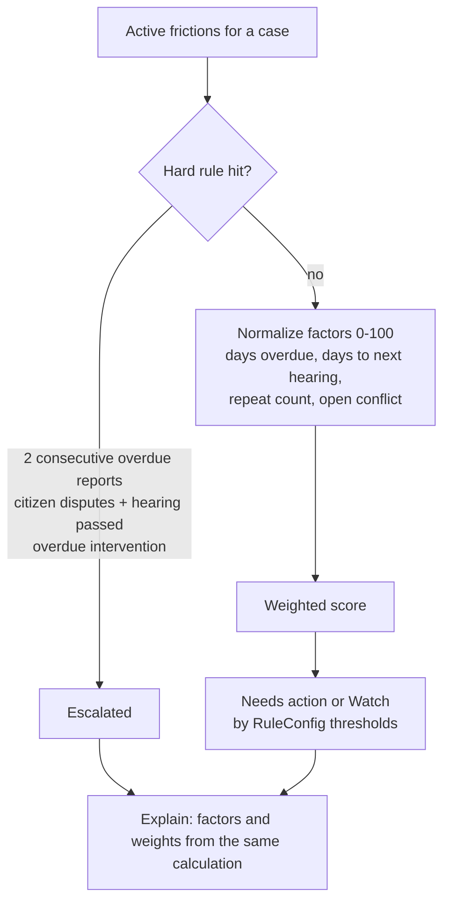
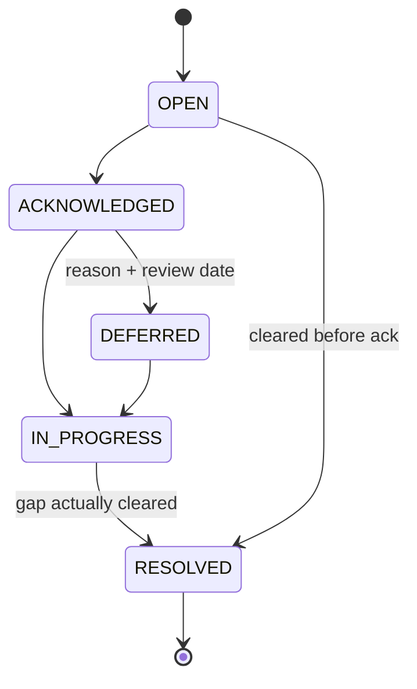
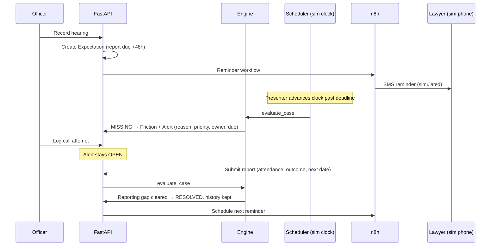
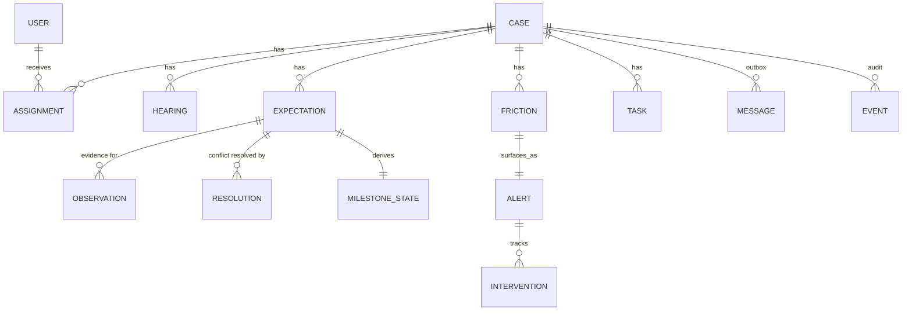

# JurisFlow — Architecture

> Technical design for the **prototype**. Built to be demonstrated live to judges: every external dependency is simulated, and the presenter controls time, messages and court data from one panel.
> Scope, roles and acceptance tests: [`spec.md`](./spec.md). Visual design: [`design.md`](./design.md).

## 1. The idea (read this first)

After a lawyer is assigned, nobody reliably knows whether the expected next step actually happened. JurisFlow answers three questions the official case system can't:

1. **What should have happened by now?** (expectations with owners and deadlines)
2. **What does the evidence say happened?** (observations from lawyer, citizen, court signal, officer, each labelled by source and trust)
3. **Who needs to act, and why?** (one explained alert per gap, tracked until actually resolved)

```
Expect → Observe → Reconcile → Detect gap → Explain → Prioritize → Assign → Act → Re-check → Schedule next
```

The loop closes when the **specific gap is resolved**, not when a message is sent.

**Positioning.** JurisFlow is a verification and intervention layer on top of the official legal-aid system. It does not replace case registration, eligibility, assignment authority, courts, or payments. In the prototype, the official system is a seeded mock.

---

## 2. Architecture at a glance



**Rule for the whole system:** everything outside our process (time, SMS, court data, speech/AI, the official case system) sits behind an adapter interface. The prototype ships only the simulated implementation. Swapping to a real one later changes no engine code.

---

## 3. Components and ownership

| Component | Owns | Must never |
|---|---|---|
| **FastAPI backend** | All state, rules, reconciliation, friction, priority, alert lifecycle, RBAC, audit events | Delegate decisions to n8n or an LLM |
| **Evidence + Friction + Priority engine** (inside backend) | `evaluate_case()`: reconcile evidence, detect gaps, explain, prioritize | Be split into separate services |
| **Scheduler + outbox worker** | Ticks on the *simulated clock*, triggers evaluation on deadlines, sends queued messages | Contain rule logic |
| **n8n** | Reminder and alert workflows, retries, delivery, the human-approval gate | Evaluate evidence or change case state |
| **ChatGPT (optional)** | Drafting and explaining text | Set state, priority, assignment, payment, discipline, eligibility |
| **PostgreSQL** | Source of truth; append-only observations and events | — |
| **Redis** | Job queue, dedup keys | Hold anything not recoverable from Postgres |
| **Next.js** | Role views, Demo Control Panel, live updates | Contain business rules |
| **Simulation layer** | Deterministic stand-ins for the outside world | Leak into engine logic (engine only sees adapter interfaces) |

### Adapter ports (the seam that makes simulation clean)

| Port | Prototype implementation | Real implementation (later) |
|---|---|---|
| `Clock` | `SimClock`: a DB row the presenter advances | System clock |
| `SmsProvider` | `SimSms`: in-app phones, forced failure, delayed delivery, typed replies | Two-way SMS gateway |
| `CourtSource` | `SimCourt`: fixture CSV/JSON plus a "publish court signal" button | Cause-list adapter (if access is authorized) |
| `Extractor` | `SimExtractor`: canned Bangla-style transcript to candidate fields; optional live LLM | Speech-to-text + extraction |
| `Drafter` | Fixed templates; optional LLM | LLM with templates |
| `CaseSystem` | Seed fixtures (mock of the official system) | DBLA Digital Legal Aid System |

---

## 4. Stack and layout

| Layer | Choice |
|---|---|
| Frontend | Next.js (server-rendered queue and timeline) |
| Backend | FastAPI, Pydantic, SQLAlchemy + Alembic |
| DB / cache | PostgreSQL / Redis |
| Scheduler | APScheduler reading `SimClock` |
| Automation | n8n (self-hosted, webhooks) |
| Live updates | Server-Sent Events (`/stream`), polling fallback |
| LLM | Provider-neutral interface, off by default |

```
/backend    app/{api,domain,engine,workers,models}
            app/adapters/{ports.py, sim/{clock,sms,court,extractor}.py}
            app/scenarios/*.json     # scripted demo scenarios
            tests/
/frontend   app/{queue,cases,lawyer,citizen,admin,sim}   components/
/n8n        workflows/*.json
/seed       fixtures.py              # 30 synthetic cases, resettable
docker-compose.yml                   # frontend, backend, worker, postgres, redis, n8n
```

Everything runs offline from one `docker compose up`. No external API is required for the demo.

---

## 5. Evidence model and reconciliation

The core of "is it actually happening" is treating every claim as an **observation** with a source, then computing a **milestone state** from the observations. Observations are append-only; state is derived and recomputable.

### Evidence states

| State | Meaning | System behaviour |
|---|---|---|
| **PENDING** | Not due yet | Wait |
| **REPORTED** | One actor claims it | Provisional; fine for low-stakes fields |
| **CORROBORATED** | Two independent actors agree | Advance |
| **VERIFIED** | An authoritative source (or authorized officer) confirms it | Advance and record |
| **DISPUTED** | Sources conflict | Freeze; route to officer; **neither value silently wins** |
| **MISSING** | Required evidence did not arrive by the deadline | Open friction |
| **STALE** *(stretch)* | Evidence too old for the decision | Request refresh |

### Source authority (scoped to what a source can prove)

| Source | Can prove | Cannot prove |
|---|---|---|
| Court signal (simulated cause list / order) | `next_hearing_date`, court | Attendance, outcome |
| Officer resolution (with cited evidence + reason) | The disputed field it resolves | Anything else; never deletes observations |
| Lawyer report | Attributed claim by that lawyer | Its own verification |
| Citizen SMS reply | Attributed claim by that citizen | Verdicts on the lawyer |
| AI-extracted candidate | Nothing until a human confirms | Any state change |

### Reconciliation (deterministic, conservative)

```
evaluate_milestone(field, observations, due_window, policy, resolutions):
  active = apply_supersession(observations)            # corrections replace, never delete
  if no required value:
      return MISSING if now > due_window.end else PENDING
  groups = group_by_normalized_value(active)
  if len(groups) > 1:
      if valid_officer_resolution(field, groups, resolutions):   # cites evidence + reason
          return VERIFIED (conflict resolved)
      return DISPUTED
  if source_is_authoritative_for(field, groups):  return VERIFIED
  if independent_actors(groups) >= 2:             return CORROBORATED
  return REPORTED
```

Rules that must hold:
- Two channels from the same actor count as **one** source.
- Confidence scores from AI affect review priority only, never truth.
- A citizen disagreement creates a review, never an automatic adverse finding about the lawyer.
- Corrections append a new observation or resolution; earlier evidence stays visible with a "superseded" label.

**Prototype fields reconciled:** `next_hearing_date` and `attendance`. Everything else uses simple present/absent checks.

---

## 6. Friction engine

**One function, two triggers.** `evaluate_case(case_id)` is called by (a) any new event (observation, resolution, delivery result, officer action) and (b) the scheduler when a window closes on the simulated clock. One code path keeps event-driven and time-driven behaviour identical.

```
evaluate_stage(stage):
  1. Expected event occurred?     no & window open   → no friction yet
                                  no & window passed → missing_event
  2. Correct actor?               no → wrong_actor
  3. Required fields complete?    no → incomplete_data
  4. Sources agree?               no → conflict            (milestone DISPUTED)
  5. Dependencies satisfied?      no → blocked_dependency
  6. All pass → no friction; resolve any open friction for this stage
```

First failure wins; a stage has at most one friction record.

| Category | Condition | In prototype |
|---|---|---|
| Reporting | hearing occurred AND now > date + grace AND no report | ✅ |
| Communication | SMS failed, OR contact attempts ≥ 3 with no response, OR citizen disputes contact/attendance | ✅ |
| Document | required doc missing AND blocks stage | ✅ |
| Scheduling | next date unknown/conflicting (surfaced via the `conflict` check) | ✅ for the date conflict |
| Capacity · Administrative · Mediation · Citizen callback | defined in the model | later |

**Dedup (one gap = one alert):** Redis key `(case_id, stage_id, category)` plus a unique DB constraint on active frictions.
**Precedence:** a known contact failure outranks "lawyer non-response".
**Silence is not risk:** a future hearing with nothing overdue produces no alert.

---

## 7. Priority engine

Output: **Watch · Needs action · Escalated**, always with a reason.



- Prototype: rules + weighted score only; UI shows *"rule-based, not yet calibrated"*.
- Explanation text is generated from the factors that produced the score, never invented by an LLM.
- If a number is shown, it is a **"follow-up priority index"**, labelled an unvalidated heuristic.
- Future (not built): with n ≥ 30 historical cases per pattern, blend in a Bayesian rate (`0.7 × weighted + 0.3 × Bayesian`; 0.7 is a placeholder).

"Risk" means follow-up priority only, never case-loss probability or misconduct.

---

## 8. Alert lifecycle



- Only re-evaluation (gap cleared) or an authorized officer resolves. **A call attempt never does.**
- Every transition is timestamped and attributed.
- Escalation changes the label, not the state.

---

## 9. Core flows

### 9.1 Missing report → resolved (everyday loop)



### 9.2 The signature moment: conflict → officer resolution → honest delivery

```mermaid
sequenceDiagram
    participant L as Lawyer
    participant C as Court signal (sim)
    participant E as Engine
    participant O as Officer
    participant DB as Postgres (one transaction)
    participant X as Outbox worker
    participant P as Citizen phone (sim)

    L->>E: Observation: next_date = 20 Oct
    C->>E: Observation: next_date = 27 Oct
    E->>E: Two values → milestone DISPUTED
    E->>O: Alert: "Next hearing date conflicts between lawyer and court"
    O->>DB: Resolution (cites both observations, authority, reason)
    Note over DB: resolution + recomputed state +<br/>next expectation + outbox row commit together
    DB-->>O: Badge: VERIFIED (conflict resolved); losing value shown "superseded"
    X->>P: SMS with verified date
    Note over O,P: UI shows QUEUED first; DELIVERED only after provider confirms
```

The UI shows two divergent lines on a mini timeline for `next_hearing_date`, a DISPUTED badge, then VERIFIED with the superseded value still visible. The message panel shows `QUEUED → SENT → DELIVERED` as separate steps.

---

## 10. Simulation layer (built for judges)

The presenter controls the outside world from a **Demo Control Panel** (`/sim`). All simulated content carries a visible **Simulated** tag; a persistent banner reads *"Prototype: simulated clock, SMS and court data."* No real money moves.

### Controls

| Control | What it does | Why it helps a demo |
|---|---|---|
| **Sim clock** | Advance +1h / +24h / +48h / jump to next deadline; pause | Show a deadline passing in one click |
| **SMS simulator** | Two phone views (lawyer, citizen). Shows inbox, delivery state, lets you type a reply; **"Force delivery failure"** toggle; optional delivery delay | Shows the outbox honesty and contact-repair path |
| **Court signal simulator** | Load fixture CSV; **"Publish court date"** button injects an authoritative observation | Triggers the DISPUTED moment on cue |
| **Voice update simulator** | Play a canned lawyer update → shows transcript → candidate fields → lawyer confirms | Shows low-effort reporting without a live speech model |
| **Citizen reply simulator** | Send "confirm / dispute / call me" as the citizen | Shows citizen input as evidence, not verdict |
| **Scenario runner** | Pick scenario A–E; loads a fixture snapshot, sets the clock, then **"Next step"** performs one scripted action at a time | Presenter sets the pace; nothing depends on live typing |
| **Reset** | Restores seed data and clock in seconds | Rehearse repeatedly |

### Scenario scripts (data, not code)

```json
{
  "id": "signature-conflict",
  "title": "Conflicting next date, resolved by officer",
  "fixture": "case_JF-1050",
  "clock_start": "2026-09-18T09:00:00+06:00",
  "steps": [
    { "label": "Hearing occurred, report missing",
      "action": { "type": "clock.advance", "hours": 49 },
      "expect": "Needs-action alert: report overdue, attendance unknown" },
    { "label": "Lawyer voice update arrives",
      "action": { "type": "voice.play", "sample": "next_date_20_oct" },
      "expect": "Reporting gap resolves; date is REPORTED" },
    { "label": "Court publishes its date",
      "action": { "type": "court.publish", "next_date": "2026-10-27" },
      "expect": "Milestone flips to DISPUTED; conflict alert opens" },
    { "label": "Officer resolves with cited order",
      "action": { "type": "await.officer", "form": "resolution" },
      "expect": "VERIFIED (conflict resolved); SMS shows QUEUED" },
    { "label": "Provider confirms",
      "action": { "type": "sms.deliver" },
      "expect": "Delivery indicator changes to DELIVERED" }
  ]
}
```

Steps of type `await.officer` pause for a real human action in the UI, so judges see authority is human.

### Simulation rules
- Simulators call the **same API endpoints** real integrations would, so the engine path is identical.
- Simulators are only enabled when `SIMULATION_MODE=true`; `/sim/*` returns 404 otherwise.
- Fixtures are deterministic (fixed IDs, fixed clock start) so every run looks the same.
- The LLM is **off by default**; canned extraction and templates keep the demo stable offline. A flag turns on live drafting.
- **n8n direct-mode fallback:** if n8n is down, the outbox worker delivers through `SimSms` directly, so the demo never stalls on an integration.

### Seed data
~30 synthetic cases across family, criminal and land types with synthetic names and phones, covering: missing report, failed SMS, missing document, two overdue reports, far-future hearing (non-alert), three adjournments, and the conflicting-date case.

---

## 11. Automation placement rule (n8n + optional ChatGPT)

1. **Needs language generation of variable content?** No → n8n only. Yes → n8n triggers, ChatGPT drafts.
2. **Citizen-facing, lawyer-facing, or changes case state?** No → auto-deliver. **Yes → mandatory human approval** before n8n sends.

| Automation | Path |
|---|---|
| Deadline reminder SMS | n8n only, auto-send (fixed template) |
| Friction alert to officer | n8n only, auto-send to dashboard |
| Escalation letter to lawyer | n8n → drafter → **officer approves** → n8n sends → logged (only human-gated flow in the prototype) |
| Verified next-date message to citizen | Fixed template; **sent on officer resolution** (the resolution is the approval); neutral wording |
| Reassignment, payment, discipline, eligibility | Never automated |

The approval "Send" button is an n8n webhook waiting for a human. The system works with the LLM off.

**Delivery boundary (outbox):** a decision, its recomputed state, the next expectation and the `Message` row commit in **one transaction**. A worker then delivers idempotently and records `QUEUED → SENT → DELIVERED | FAILED`. The UI never claims delivery before `DELIVERED`. A failed SMS never rolls back the decision; it opens a contact-repair task.

---

## 12. Data model

Timestamps are timezone-aware (`Asia/Dhaka`). `Observation`, `Resolution` and `Event` are append-only.



```
Case(id, reference, type, status, opened_at, sensitivity, district_id)
User(id, role[citizen|lawyer|dlo|staff|admin], name, phone)
LawyerProfile(user_id, practice_areas[], availability, capacity, active_caseload)
Assignment(id, case_id, lawyer_id, status[offered|accepted|declined|reassigned], conflict_check_done)
Hearing(id, case_id, scheduled_at, status[scheduled|occurred|adjourned|cancelled])

Expectation(id, case_id, stage, expected_event, responsible_actor_id, window_end,
            required_fields[], depends_on[], rule_id, rule_version,
            status[pending|met|missed|cancelled])
Observation(id, expectation_id, field, value, source_type[lawyer|citizen|court_signal|officer|ai_candidate],
            source_actor_id, channel, confidence?, observed_at, captured_at, raw_ref?,
            supersedes_observation_id?, simulated)                     # APPEND-ONLY
Resolution(id, expectation_id, field, chosen_value, observation_ids[], officer_id,
           authority_basis, reason, resolved_at)                        # APPEND-ONLY
MilestoneState(expectation_id, field, state, last_evaluated_at,
               contributing_observation_ids[], resolution_id?)          # derived, recomputable

Friction(id, case_id, category, check_failed[missing_event|wrong_actor|incomplete_data|conflict|blocked_dependency],
         state[OPEN|ACKNOWLEDGED|RESOLVED], reason_text, evidence_timestamps[], rule_id, rule_version)
Alert(id, friction_id, label[watch|needs_action|escalated], factors_json, owner_id,
      due_at, state, deferral_reason?, review_date?)
Intervention(id, alert_id, officer_id, action[call_attempt|obtain_update|request_verification|reassign|other],
             note, result, created_at)                                  # call_attempt never auto-resolves
Task(id, case_id, kind[date_check|contact_repair|callback], owner_id, due_at, status)
Message(id, case_id, template, to, status[QUEUED|SENT|DELIVERED|FAILED], idempotency_key,
        attempts, requires_approval, approved_by?, simulated)          # the outbox
Event(id, case_id, type, actor_id, payload, occurred_at, supersedes_event_id?)   # audit log
RuleConfig(rule_id, version, params_json)      # grace period, overdue count, adjournment count, weights
SimClock(now, paused)
ClaimPacket(id, case_id, lawyer_id, status, items[])   # STRETCH: readiness only, no disbursement
```

Modelling rules:
- A hearing report form writes several observations (attendance, outcome, next date). Attendance and outcome stay separate; attendance is self-reported unless verified.
- Every alert stores its rule id + version.
- Corrections append; nothing is edited or deleted.
- Idempotency keys on observation submission and message sends.

---

## 13. API surface

| Endpoint | Purpose |
|---|---|
| `POST /cases` | Create case (web form or walk-in) |
| `POST /cases/{id}/assignments` · `POST /assignments/{id}/accept` | Assign from filtered list; lawyer accepts |
| `POST /hearings` | Record or reschedule (creates expectation) |
| `POST /cases/{id}/observations` | Submit an attributed observation (report fields, citizen reply, court signal) |
| `POST /expectations/{id}/resolutions` | Officer resolves a conflict (cited observations + reason) |
| `GET /officer/queue` | Prioritized open alerts |
| `POST /alerts/{id}/transition` · `POST /alerts/{id}/interventions` | Move state; record action |
| `GET /cases/{id}/timeline` | Append-only evidence, states, resolutions |
| `POST /messages/{id}/approve` | Approve a gated draft |
| `POST /webhooks/sms-status` | Delivery result |
| `GET/PUT /admin/rules` | Versioned thresholds |
| `GET /stream` | SSE live updates for UI |
| `POST /sim/clock` · `/sim/sms` · `/sim/court` · `/sim/voice` · `/sim/citizen-reply` | Simulator controls (`SIMULATION_MODE` only) |
| `POST /sim/scenario/{id}/load` · `/next` · `/sim/reset` | Scenario runner and reset |

Every endpoint enforces role- and case-scoped RBAC server-side.

---

## 14. Screens the architecture must serve

Officer queue · Case timeline (with reconciliation view for disputed fields) · Alert detail + intervention workspace · Lawyer report form (with simulated voice draft) · Citizen status and reply · Admin rules · **Demo Control Panel**. Layouts and styling are in [`design.md`](./design.md).

---

## 15. Key decisions

| Decision | Why |
|---|---|
| Rules + weighted score, not an ML/LLM risk score | Must be explainable and auditable; no data to validate a model |
| Evidence states derived from append-only observations | Preserves disagreement and history; corrections never destroy evidence |
| Authority scoped to what a source can prove | The court signal can verify a date but never attendance |
| Friction and priority live in one module | Two responsibilities, no reason for two services in an MVP |
| Backend owns all logic; n8n orchestrates only | Testable, auditable; makes the approval gate architectural |
| One `evaluate_case()` for events and time | No drift between event-driven and scheduled behaviour |
| One gap = one alert (Redis key + DB constraint) | Prevents alert fatigue |
| Outbox for messages | A failed SMS cannot corrupt a committed decision; UI stays honest |
| All externals behind adapters with sim implementations | Repeatable, offline, presenter-controlled demo; easy real swap later |
| Scripted scenarios as data | Consistent rehearsals, step-by-step pacing |
| LLM optional, off by default | Decisions never depend on it; demo stays stable |

---

## 16. Cross-cutting concerns

- **Security:** seeded role accounts, server-side RBAC on every endpoint, no secrets in code. Production identity is out of scope.
- **Audit:** every state change writes an `Event` (who, what, when, rule id + version).
- **Errors:** external calls fail soft: outbox retries with backoff, LLM falls back to templates, n8n falls back to direct delivery.
- **Config:** thresholds in versioned `RuleConfig`, never hardcoded.
- **Privacy:** synthetic data only; citizen SMS wording is neutral because phones may be shared.
- **Labelling:** simulated content is tagged in the UI and in the data (`simulated` flag).

---

## 17. Prototype vs production

| Prototype | Production (later) |
|---|---|
| Sim clock, SMS, court signal, voice extraction | Real adapters behind the same ports |
| Officer picks lawyer from filtered list | Ranked shortlist with workload and conflict check |
| Mock official case system | Authorized DBLA integration |
| Reconciliation on `next_hearing_date` + `attendance` | All milestone fields, staleness rules |
| 3 friction categories + date conflict | All categories incl. mediation |
| Weighted score only | Bayesian blend at n ≥ 30 |
| Payment-readiness packet (stretch, no disbursement) | Authorized finance process |
| Seeded accounts | Real identity and MFA |
