# Shakkho — System Architecture

**Status:** Canonical target architecture for prototype implementation

**Document precedence:** **[ADLASB Final Round Case PDF](../ADLASB/ADLASB-Hackathon_Final-Round_Case.pdf) → [PRD](../PRD/PRD.md) → this architecture**. On conflict, the higher document wins. The canonical precedence and evidence-resolution rule is maintained in [reconciliation-rules.md](reconciliation-rules.md#document-precedence).

**Product and implementation name:** **Shakkho**

**Architecture style:** Secure modular monolith with an installable offline-capable PWA, PostgreSQL, append-only audit events, explicit human decision gates and adapter-based external integrations

> Legal aid rarely fails because a record does not exist. It fails when nobody can prove who accepted the next obligation, whether it was completed, and whether the result was safely communicated.

---

## 1. Purpose and architectural outcome

This document converts the final solution model into a buildable architecture. It is not a new product concept and does not replace the PRD. It defines:

- the runtime boundaries and modules;
- the source of truth for state and audit;
- how the five access doors share one record;
- how human authority is enforced rather than merely described;
- how offline events join the authoritative record;
- how promises, referrals, mediation, lawyers, notifications and payment evidence interact;
- how privacy, withdrawal, safe contact and accessibility work technically;
- which external services are simulated in the prototype;
- how the system scales from a multi-district pilot to 64 districts without a second architecture;
- how every mandatory A/B/T item produces a real state change and audit event.

The architecture optimises for a credible five-day prototype while keeping production seams visible. It is intentionally a **modular monolith**, not a premature microservice estate. Modules have strict ownership and transactional boundaries so that high-volume capabilities can be separated later without changing the domain model.

### 1.1 Naming convention

| Name | Meaning |
|---|---|
| **Shakkho** | The complete legal-aid operating model and this repository's prototype implementation |
| **DLAS** | The wider Digital Legal Aid System context described by ADLASB |

Use **Shakkho** consistently in UI labels, code, documentation, diagrams and event descriptions. A later product rename must be handled as one coordinated documentation and branding change, not as a second workflow or architecture.

### 1.2 Non-goals

The prototype is not:

- an AI lawyer or automated legal decision-maker;
- a replacement for DLAO, Legal Aid Officer, mediator, lawyer, appeal or finance authority;
- a blockchain or an absolutely tamper-proof store;
- a live 16699, NID, court, payment, email or SMS integration unless an approved interface is actually available;
- a Village Court/Gram Adalat implementation;
- seven provider applications with duplicated records;
- proof of national impact based on seeded prototype measurements.

---

## 2. Architecture principles

1. **One canonical record, many role-scoped projections.** Every channel and provider acts on the same Application or Case ID.
2. **State and evidence change together.** A successful command updates canonical state, appends an audit event and creates or completes any resulting promise in one transaction.
3. **Sent is not accepted.** A handoff remains owned by the sender until the receiving actor accepts it.
4. **Recorded is not verified.** Every material field retains its source, speaker, typist, translator, confirmer and inference status.
5. **Human authority is enforced in code.** Consequential transitions require an authorised role, visible evidence and a recorded reason where required.
6. **Sensitive payloads are withdrawable.** PII and unsafe narrative live outside the immutable event body in a separately protected vault.
7. **Citizen-visible status is safe by construction.** It comes from approved templates and typed slots, never free-form LLM output.
8. **Offline is a first-class path.** Local records receive temporary IDs, sync idempotently and never splice directly into the authoritative hash chain.
9. **Failure is visible and owned.** Network loss, non-acknowledgement, failed notification, disagreement and unreadable evidence produce explicit states and responsible fallback tasks.
10. **Configure districts; do not fork code.** Office directory, policies, panels, templates, timers and languages are versioned configuration.
11. **Simulate only unavailable boundaries.** Internal workflow, state changes, timers, failures and audit entries remain real.
12. **Bangla and assisted access are primary architecture concerns.** Accessibility is not a later UI patch.

---

## 3. Four-layer system view

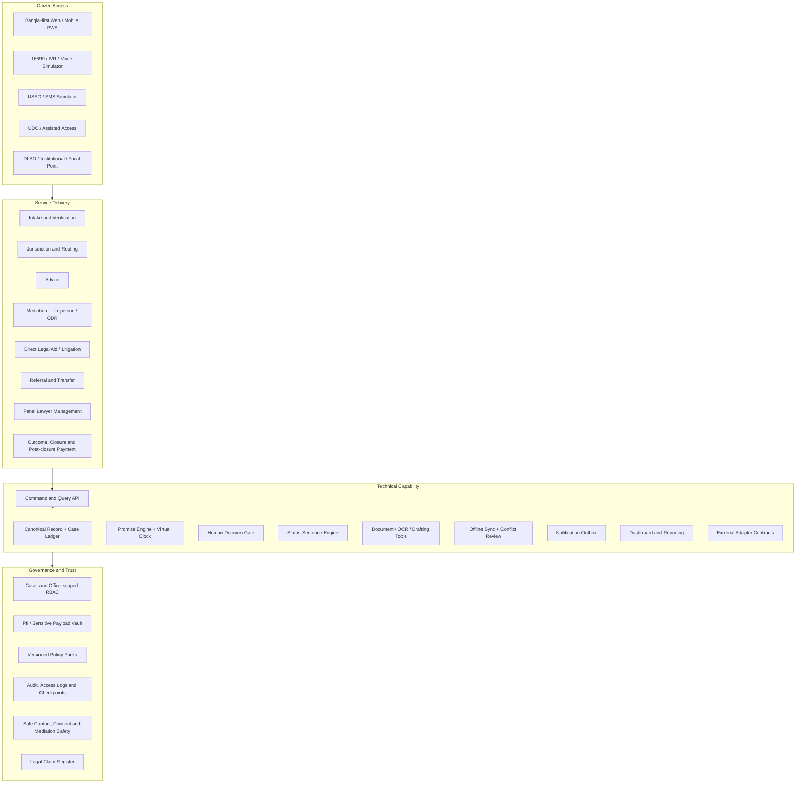

The four layers describe one runtime. They do not represent separate applications or databases.

---

## 4. System context

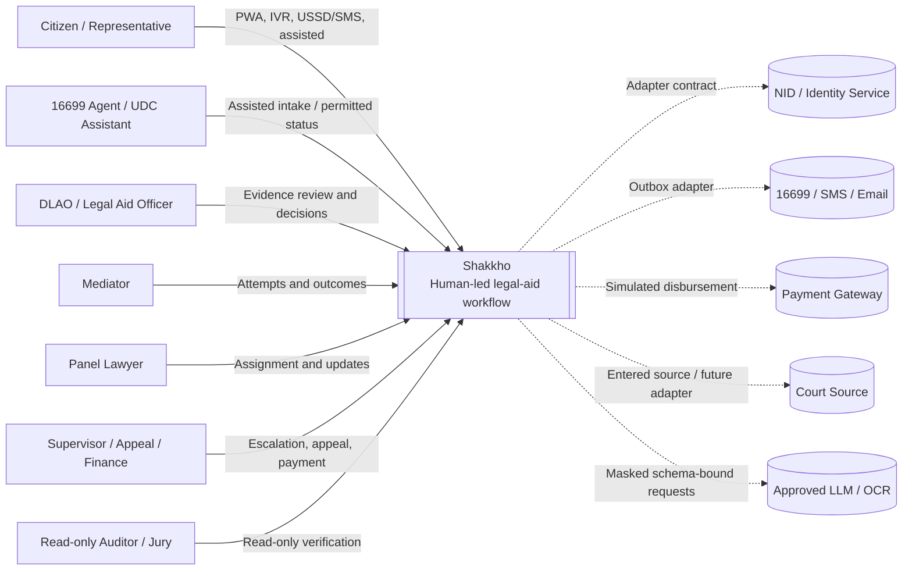

---

## 5. Deployable container architecture

### 5.1 Prototype deployment

```mermaid
flowchart LR
    subgraph Browser[Citizen or Provider Device]
        PWA[Next.js PWA]
        IDB[(Encrypted IndexedDB Queue)]
        SW[Service Worker]
        CRYPTO[WebCrypto]
        PWA <--> IDB
        PWA <--> SW
        PWA <--> CRYPTO
    end

    subgraph App[Always-on Application Runtime]
        NEXT[Next.js UI + Server API]
        DOMAIN[Domain Modules]
        SCHED[Virtual-clock Scheduler]
        WORKER[Outbox / OCR / AI Worker]
        SELFTEST[/selftest Runner]
        NEXT --> DOMAIN
        SCHED --> DOMAIN
        WORKER --> DOMAIN
        SELFTEST --> NEXT
    end

    subgraph Data[Data Services]
        PG[(PostgreSQL)]
        OBJ[(Private Object Storage)]
    end

    subgraph External[Adapter Boundaries]
        SMS[SMS / Email / 16699 Simulators]
        PAY[Payment Simulator]
        COURT[Court / NID Interface Stubs]
        MODEL[LLM / OCR Provider]
    end

    PWA <-->|HTTPS JSON| NEXT
    DOMAIN <--> PG
    DOMAIN <--> OBJ
    WORKER --> SMS
    WORKER --> PAY
    WORKER --> COURT
    WORKER --> MODEL
```

### 5.2 Technology decisions

| Concern | Prototype decision | Production seam |
|---|---|---|
| UI | Existing Next.js 16 App Router frontend, TypeScript, React, CSS tokens (decoupled from Supabase) | Separate CDN/edge delivery if needed |
| API | FastAPI service (`backend/apps/api`) with Pydantic contracts and pure reconciliation domain | High-performance asynchronous API endpoints |
| Database | Supabase (PostgreSQL) with connection pooling (port 6543/5432); tenant, office and case scope on every protected row | Managed HA PostgreSQL, Supavisor connection pooling, read replicas, partitioning |
| Files | Private object storage; database stores metadata/hash only | Government-approved object store and malware scanning |
| Offline | Service worker + IndexedDB encrypted with AES-GCM | Managed device policy and approved key management |
| Crypto | WebCrypto/SHA-256; ECDSA P-256 for T11 | Approved PKI, identity proofing and signing authority |
| Async work | Database-backed outbox and scheduler run in-process in the single always-on application process | Dedicated queue/worker only when measured load requires it |
| AI/OCR | Server-side adapter, masked input, strict schemas and deterministic fallback | Approved in-country/on-prem providers |
| Testing | `/selftest`, focused domain tests and a few critical Playwright paths | Broader contract, integration, security and accessibility suites after the prototype |
| Public host | One Fly.io Machine in `sin` (Singapore), `auto_stop_machines = "off"`, health checked and always running | Multi-machine/high-availability deployment after the prototype |

The Day-1 deployment target is therefore fixed: containerise the application, deploy one continuously running Fly Machine in Singapore, run the scheduler/outbox loop in that process, and verify that promises become overdue without incoming HTTP traffic. Fly.io's current official configuration supports disabling automatic stop and lists `sin` as Singapore; retain a local Docker fallback. See [Fly.io autostop/autostart configuration](https://fly.io/docs/launch/autostop-autostart/) and [Fly.io regions](https://fly.io/docs/reference/regions/).

### 5.3 Why a modular monolith

The prototype needs cross-module atomicity more than independent service scaling. Eligibility acceptance, for example, must create the Case ID, update the application, append the event and create the next promise without partial success. A modular monolith gives this transaction boundary and fits the delivery window. Clear module APIs and an outbox preserve a later path to services.

### 5.4 Five-day depth boundary

The architecture describes a production path, but the competition implementation stays intentionally thin:

- **Authorisation:** enforce tenant, authenticated role, office and case assignment on the server. Implement break-glass only for Nabila's restricted evidence scenario.
- **Vault:** use an encrypted PostgreSQL column plus the per-payload HMAC key and mask/key-destroy withdrawal behavior; do not build an external vault service.
- **Worker:** run the scheduler and transactional-outbox loop in the always-on application process with a database lease so only one loop owns a job.
- **Testing:** make `/selftest` the 23-item regression backbone and add Playwright only for the critical public paths listed in Section 25.
- **Interfaces:** publish the small adapter schemas actually used by simulators; a complete enterprise OpenAPI governance programme is post-prototype.

“Thin” changes implementation depth, not required behavior: state transition, human authority, failure recovery and audit evidence still have to work.

---

## 6. Domain modules and ownership

| Module | Owns | May call | Must not do |
|---|---|---|---|
| Identity & Session | `CitizenSession`, `OtpSession`, safe phrase verification, role session | Safe Contact, Access Control | Send OTP to an unsafe channel or expose case status before verification |
| Intake & Application | drafts, submissions, `TEMP` mapping, Application ID, receipt, representation | Documents, Duplicate Review, Promise | Create a Case ID before authorised acceptance |
| Case & Workflow | canonical case state, service pathway, outcome, closure | Decision Gate, Promise, Referral, Mediation, Lawyer | Make consequential decisions on behalf of roles |
| Provenance & Vault | field claims, source metadata, sensitive payloads, correction/withdrawal | Ledger, Access Control | Put unsafe plaintext into the immutable event body |
| Ledger & Integrity | append-only events, previous hash, checkpoint, verifier | no domain mutation | Become the operational state database or claim tamper-proofing |
| Promise Engine | handoff/duty/citizen-owed tasks, due state, escalation | Notification, Reporting | Treat “sent” as accepted or citizen unreachable as refusal |
| Human Decision Gate | decision request, evidence bundle, reason, authority check | Policy, Ledger, Workflow | Hide evidence behind a recommendation |
| Safe Contact & Status | contact policy, safe phrase, template status, travel advisory | Notification, Case | Generate citizen-visible status through free-form AI |
| Documents & Knowledge | versions, hashes, OCR spans, checklist, approved articles/templates | AI Adapter, Object Store | Guess unreadable content or expose restricted evidence |
| Mediation | safety screen, notices, attempts, party mode/attendance, outcome | Decision Gate, Documents, Signature | Auto-schedule flagged joint mediation or infer consent |
| Referral | package, receiver, return, acknowledgement, transfer chain | Promise, Directory | Transfer ownership before acceptance |
| Panel Lawyer | registry, approval, workload, assignment, updates, handover | Decision Gate, Promise, Payment | Rank by win rate or declare misconduct |
| Payment | interim/final stage evidence, T1 reassignment reconciliation, approval and simulated disbursement | Finance Decision, Ledger | Block closure or calculate automatic recoverable amounts |
| Notification | templates, outbox, delivery attempts, in-app centre | Adapters, Safe Contact | Send unsafe free text or conflate SENT with DELIVERED |
| Reporting | DLAO queue, SLA, district and prototype metrics | read-only projections | Maintain a parallel reporting truth |
| Policy & Directory | offices, panels, thresholds, templates, effective versions | all modules read | Retroactively change the rule version recorded on an event |
| Integration Registry | contracts and `REAL/SIMULATED` status | adapters | Claim a simulator is a live integration |
| Grievance & Appeal | grievance lifecycle and applicable appeal review | Decision Gate, Notification | Override the original record invisibly |
| Demo Control | visitor tenant, reset, virtual time, scenario seeds | scheduler/test APIs | Run in production mode or change actual system time |

Modules communicate through typed commands and domain events, not direct cross-module table mutation.

---

## 7. Command, transaction and query model

### 7.1 Command transaction contract

Every state-changing request follows the same server transaction:

```text
authenticate session
→ authorise role + office + case scope
→ validate command schema and idempotency key
→ load canonical aggregate with row/version lock
→ evaluate allowed state transition
→ enforce Human Decision Gate where consequential
→ persist canonical state
→ append per-application/per-case ledger event
→ create/accept/fulfil/escalate resulting PromiseTask records
→ create NotificationOutbox records, never send inline
→ update transactional projection/version markers
→ commit
→ return new state + event ID + safe next action
```

If any in-transaction step fails, none of the state, event or promise changes commit. External delivery runs after commit through the outbox.

### 7.2 Command envelope

```ts
type CommandEnvelope<T> = {
  commandId: string;          // UUID; idempotency key
  tenantId: string;           // visitor namespace in public prototype
  applicationId?: string;
  caseId?: string;
  actorId: string;
  actingRole: Role;
  officeId?: string;
  channel: Channel;
  authorityBasis?: string;
  expectedVersion: number;    // optimistic concurrency
  deviceTime?: string;        // informative, never authoritative
  serverAnchor?: string;
  payload: T;
};
```

The server derives permissions from the authenticated session. It never trusts `actingRole`, `officeId` or tenant scope merely because the client sent them.

### 7.3 Queries and projections

Queries read role-scoped projections, not unrestricted domain rows. Important projections are:

- citizen safe-status view;
- 16699 permitted-disclosure view;
- UDC active-assistance view with expiry;
- DLAO Today/SLA/decision queue;
- mediator attempt timeline;
- lawyer assignment/calendar/update view;
- receiving-office referral inbox;
- finance interim/final payment-stage queue;
- supervisor escalation queue;
- read-only audit/integrity view;
- 23/23 coverage navigator.

Projection lag is zero inside the modular monolith for core state because projection version markers update in the same transaction. Non-critical analytics may refresh asynchronously and must show freshness time.

---

## 8. Canonical data model

### 8.1 Identity and tenancy fields

Every protected table includes:

- `tenant_id` — isolates each public juror/demo visitor;
- `office_scope_id` where institutional scope applies;
- `created_at_server` and `updated_at_server`;
- `created_by_actor_id`;
- `row_version` for optimistic concurrency;
- soft-retention or withdrawal state where applicable.

Production tenants represent the programme, not individual citizens. The per-visitor tenant is a prototype isolation mechanism.

#### Public-demo tenant lifecycle

- Create at most one active demo tenant per browser/session and seed it from one deterministic fixture transaction.
- Seed target is under two seconds; show progress and retry safely rather than exposing a half-seeded tenant.
- Expire a tenant after six hours of inactivity or 24 hours absolute lifetime.
- A garbage-collection job runs every ten minutes and deletes expired synthetic rows, object-store fixtures and derived caches.
- Treat 200 active demo tenants only as an initial hard safety ceiling, never as a supported-capacity claim. Before freeze, load-test at least 25 simultaneous visitor tenants performing seed, reset and core reads/writes; record p95 latency, seed/reset time and error rate, then set or lower the operational cap from evidence. At the cap, reuse the caller's existing tenant or show a retry response; never fall back to a shared mutable tenant.
- Reset is idempotent: mark the old generation inactive, reseed a new generation and prevent late requests from the old generation mutating it.
- These deletion rules apply only to synthetic public-demo tenants, not production legal-aid retention.

#### Required fixture corpus

- Two complete T5 Bangla conversations and about ten utterance variants cover colloquial wording, spelling variation, correction and sensitive/ambiguous human handoff.
- Six to eight versioned approved knowledge articles/templates are searchable by 16699 agents and UDC assistants and are cited when T5/T7 use them.
- The remaining named citizens, providers, T1–T4/T6–T11 counts and trap/failure fixtures follow the PRD seed-data contract; architecture code must not replace them with generic records.

### 8.2 Core aggregates

```mermaid
erDiagram
    TENANT ||--o{ APPLICATION : contains
    APPLICATION ||--o| CASE : becomes
    APPLICATION ||--o{ PERSON_PARTY : identifies
    CASE ||--o{ PERSON_PARTY : involves
    APPLICATION ||--o{ STATEMENT_CLAIM : contains
    CASE ||--o{ STATEMENT_CLAIM : contains
    STATEMENT_CLAIM }o--|| VAULT_PAYLOAD : references
    APPLICATION ||--o{ DOCUMENT : has
    CASE ||--o{ DOCUMENT : has
    DOCUMENT ||--o{ DOCUMENT_VERSION : versions
    DOCUMENT ||--o{ DOCUMENT_LINK : shared_through
    CASE ||--o{ DOCUMENT_LINK : grants_case_access
    APPLICATION ||--o{ AUDIT_EVENT : chains
    CASE ||--o{ AUDIT_EVENT : chains
    CASE ||--o{ PROMISE_TASK : requires
    CASE ||--o{ DECISION : records
    CASE ||--o{ REFERRAL : transfers
    CASE ||--o{ MEDIATION_ATTEMPT : attempts
    CASE ||--o{ LAWYER_ASSIGNMENT : assigns
    LAWYER_ASSIGNMENT ||--o{ HEARING_UPDATE : reports
    CASE ||--o{ PAYMENT_STAGE : reconciles
    CASE ||--o{ NOTIFICATION_OUTBOX : notifies
    APPLICATION ||--o{ NOTIFICATION_OUTBOX : notifies
    APPLICATION ||--o{ APPEAL_REVIEW : appeals
    APPLICATION ||--o{ GRIEVANCE : concerns
    CASE ||--o{ GRIEVANCE : concerns
    APPEAL_REVIEW ||--o{ NOTIFICATION_OUTBOX : notifies
    GRIEVANCE ||--o{ NOTIFICATION_OUTBOX : notifies
    CASE }o--o| RELATED_INCIDENT_GROUP : links
    RELATED_INCIDENT_GROUP ||--o{ DOCUMENT_LINK : shares
    APPLICATION ||--o{ DUPLICATE_CANDIDATE : evaluates
    CASE ||--o{ TRIAGE_RUN : triages
    TRIAGE_RUN ||--o{ TRIAGE_FINDING : produces
    APPLICATION ||--o{ CONFLICT_REVIEW : resolves
    CASE ||--o{ CONFLICT_REVIEW : resolves
    CASE ||--o{ SETTLEMENT_DRAFT : drafts
    SETTLEMENT_DRAFT ||--o{ SIGNATURE_ENVELOPE : signs
    AUDIT_EVENT }o--o| CHECKPOINT : verifies
```

### 8.3 Key records

| Record | Minimum architecture fields |
|---|---|
| `Application` | official/temp ID, status, channel, office, application type/method, requested aid, previous reference, child flag, category, case type/subtype, vulnerability flags |
| `Case` | immutable Case ID, application ID, pathway, owner office, status, priority, closure state, payment state, policy version |
| `PersonParty` | person ID, case/application role, applicant/opposite-party/child/representative type, vault-backed identity/contact references, case-specific visibility |
| `VulnerabilityFlag` | application/person, flag type, source/provenance, confidence/confirmation, restricted-access class, active/withdrawn state |
| `Consent` | subject, consent type including `VERBAL_READBACK`, scope, method, witness/assistant, granted/withdrawn time and evidence reference |
| `StatementClaim` | field key, vault payload ID, opaque keyed commitment, source actor/organisation/channel, provenance category, confirmation state, supersedes ID |
| `VaultPayload` | encrypted payload, classification, per-payload HMAC key/salt reference, retention/withdrawal status, encryption-key reference, created/withdrawn metadata |
| `RepresentationAuthority` | representative, represented person, scope, basis, confirmed/unconfirmed parts, validity |
| `SafeContactPolicy` | channel/number, safe/unsafe/unknown, safe time, neutral wording requirement, quiet hours, verification source |
| `Decision` | type, evidence references, recommendation, human result, reason, authority, policy version, decision time |
| `PromiseTask` | type, owner, sender, receiver, due time, state, acceptance, evidence required, escalation rung |
| `Referral` | sending/receiving office, package manifest, reason, requested action, acknowledgement deadline, return reason, transit owner |
| `MediationAttempt` | safety result, attempt number, party modes, notice/attendance, consent, outcome, reschedule link |
| `LawyerAssignment` | lawyer, approval/profile snapshot, workload snapshot, offer/acceptance, handover and coverage state |
| `PanelLawyerRegistry` / `PanelWorkloadProjection` | lawyer approval, practice areas, office/panel, current assignments/due work, communication feedback and projection freshness |
| `HearingUpdate` | assignment/case, reported date/status, source type, source document, next obligation and verification state |
| `FeeSchedule` | version, `ILLUSTRATIVE_NOT_POLICY` label, effective demo scope and stage definitions used only for T1 reconciliation |
| `DocumentVersion` | object key, hash, media type, source, quality, OCR status, latest flag, access class |
| `DocumentLink` | document ID, case/group ID, access class, granted roles/offices, purpose, created/revoked metadata; enables upload-once without merging cases |
| `DuplicateCandidate` | application pair, compared attributes, score/reason codes, disclosure tier, human result, reversible decision event |
| `TriageRun` / `TriageFinding` | input snapshot, component/version, category/urgency/jurisdiction result, evidence/reason codes, disagreement and human resolution |
| `ConflictReview` | offline UUIDs/field, base and competing values by vault reference, reviewer, resolution, authority and resulting events |
| `SettlementDraft` | case, template/version, scenario type, inferred spans, deterministic warnings, review/lock version and source notes |
| `SignatureEnvelope` | draft/document version, canonical hash, signer metadata, signature/public key, device/server times, verification and invalidation state |
| `AppealReview` | application/rejection decision, filed material, competent authority, review status, outcome/reason, decision event and notification status |
| `Grievance` | subject application/case/provider, category, description vault reference, investigator, status, resolution, closure decision and notifications |
| `KnowledgeArticle` / `ApprovedTemplate` | type, Bangla/English content/version, source/approval, effective status, allowed roles/tools and supersession |
| `TravelAdvisory` | case, `TRAVEL_REQUIRED/NO_TRAVEL_NEEDED/UNKNOWN`, source, validity window, human verifier and delivered status |
| `TemporaryReceipt` | `TEMP-xxxx`, device/session, created time, encrypted-queue reference, pending/synced/discarded state and official-ID mapping |
| `Device` / `SyncSession` | device pseudonymous ID, operator/session, anchor, local/server sequence, authentication/expiry and sync result |
| `Report` | report type, district/office filters, event cut-off/freshness, generated artefact and generator actor |
| `NotificationOutbox` | safe template, typed slots, recipient route, `QUEUED/SENT/DELIVERED/FAILED/SUPPRESSED`, attempts |
| `AuditEvent` | event UUID, aggregate ID/type, sequence, actor/role/office/channel, authority, before/after refs, opaque payload commitment, previous/event hash |
| `AccessLog` / `BreakGlassAccess` | actor, role, record, action, purpose, break-glass reason/expiry/review, timestamp |
| `CitizenSession` / `OtpSession` / `SafePhrase` | citizen/session reference, safe channel, OTP lifecycle, phrase verifier, expiry, attempts and disclosure level |
| `Checkpoint` | tenant/event cut-off, deterministic root, external-to-database signature, public-key ID and verification result |
| `PolicyPackVersion` | effective dates, geography, source/claim-register reference, status, configuration hash and named settings including `referral_return_threshold = 2` |

### 8.4 Identifier rules

- Offline draft receipt: `TEMP-xxxx`.
- Submitted application: `APP-YYYY-XXXXX`.
- Accepted legal-aid case: `DLAS-YYYY-XXXXX`.
- Keypad reference: digits only, with prefix choice `1 application` / `2 case`.
- Visible IDs are lookup references, never authentication secrets.
- Case ID remains stable across referrals, mediation, representation, outcome and post-closure payment.

### 8.5 T3 related-incident confidentiality contract

`RelatedIncidentGroup` is an operational staff index, not a shared citizen workspace.

- Only authorised staff roles receive the group projection. A citizen/applicant query is always scoped to that person's own case and never returns co-applicant identity, status, instructions or outcome.
- `Document` is stored once. A separate `DocumentLink` grants each case access with its own role/office/classification policy; sharing the binary never merges cases or parties.
- Withdrawing one applicant or revoking one case's access closes only that case's `DocumentLink`. It does not delete the underlying shared document or revoke another case's independently lawful link.
- Case-specific claims, legal instructions, confidentiality, decisions, outcomes, notifications and ledger events remain on their own Case IDs.
- Before assigning or reassigning a lawyer on any linked case, the Panel Lawyer module performs a conflict check across the full group using privacy-preserving party/opposing-party references. A possible conflict goes to authorised human review and reveals only the minimum necessary comparison.
- Every group-view access and link grant/revocation is audited. Group membership is reversible by a human decision and never inferred as fraud or common representation.

### 8.6 PRD-to-architecture entity map

This table is the anti-drop contract. Every entity named in the PRD has an explicit persistence record or an explicit composition below.

| PRD entity | Architecture record / realization |
|---|---|
| `Application` | `Application` aggregate |
| `Case` | `Case` aggregate |
| `PersonParty` | `PersonParty` with vault-backed identity and case-specific visibility |
| `RepresentationAuthority` | `RepresentationAuthority` record linked to people/application/case |
| `StatementClaim` | `StatementClaim` + `VaultPayload` keyed commitment |
| `ConfirmationCorrectionWithdrawal` | `StatementClaim.supersedes_id`, vault state and typed `AuditEvent` records |
| `SafeContactPolicy` | `SafeContactPolicy` record evaluated before disclosure/delivery |
| `Consent` | `Consent`, including `VERBAL_READBACK` and withdrawal |
| `Document` | `Document`, `DocumentVersion` and per-case `DocumentLink` |
| `Decision` | `Decision` through the Human Decision Gate |
| `PromiseTask` | `PromiseTask` aggregate |
| `Referral` | `Referral` aggregate and transfer-chain events |
| `MediationAttempt` | `MediationAttempt` aggregate |
| `LawyerAssignment` | `LawyerAssignment` aggregate |
| `PanelLawyerRegistry` | `PanelLawyerRegistry` |
| `PanelWorkloadProjection` | derived `PanelWorkloadProjection` with freshness time |
| `HearingUpdate` | `HearingUpdate` with source/provenance |
| `PaymentStage` | interim/final `PaymentStage` records |
| `OutcomeClosure` | outcome fields/events on `Case` plus authorised closure `Decision` |
| `AppealGrievance` | split into `AppealReview` and `Grievance`; no overloaded combined table |
| `RelatedIncidentGroup` | `RelatedIncidentGroup` + case memberships and `DocumentLink` |
| `AuditEvent` | per-aggregate `AuditEvent` chain |
| `PolicyPackVersion` | `PolicyPackVersion` plus versioned settings |
| `CitizenSession` | `CitizenSession` |
| `OtpSession` | `OtpSession` |
| `SafePhrase` | salted/slow verifier referenced by `SafePhrase`; never stored as plaintext |
| `VaultPayload` / payload-redaction state | encrypted `VaultPayload`, per-payload HMAC key and withdrawal/key-destruction state |
| `VulnerabilityFlag` | `VulnerabilityFlag` with restricted source/provenance |
| `NotificationOutbox` | `NotificationOutbox` plus delivery attempts |
| `Grievance` | `Grievance` lifecycle aggregate |
| `KnowledgeArticle` | versioned `KnowledgeArticle` |
| `ApprovedTemplate` | versioned `ApprovedTemplate` used by T7/status/notifications as allowed |
| `FeeSchedule` | versioned, visibly illustrative `FeeSchedule` |
| `AccessLog` | append-only `AccessLog` |
| `BreakGlassAccess` | `BreakGlassAccess` grant/review linked to access events |
| `SyncSession` | `SyncSession` batch/anchor record |
| `Device` | pseudonymous `Device` record |
| `Checkpoint` | signed `Checkpoint` plus exported-event verifier |
| `Report` | generated `Report` metadata/artefact sourced from ledger cut-off |
| `TravelAdvisory` | `TravelAdvisory` with source and validity |
| `TemporaryReceipt` | `TemporaryReceipt` mapping `TEMP-xxxx` to the official Application ID |

---

## 9. State machines

### 9.1 Application

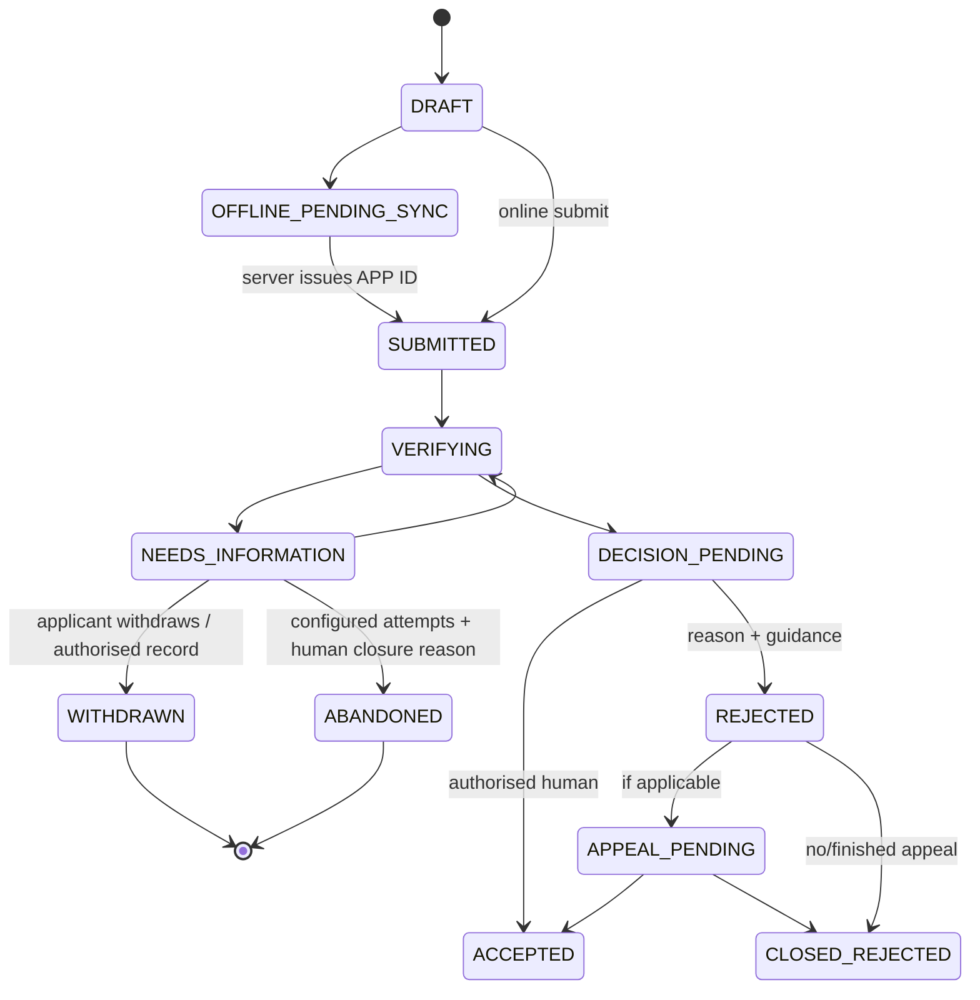

Only `ACCEPTED` creates the Case ID. `ABANDONED` is never inferred from silence alone: the configured safe-contact attempts, elapsed period and authorised human reason must be recorded. A later authorised restoration creates an explicit restoration event rather than rewriting history.

### 9.2 Case and service pathway

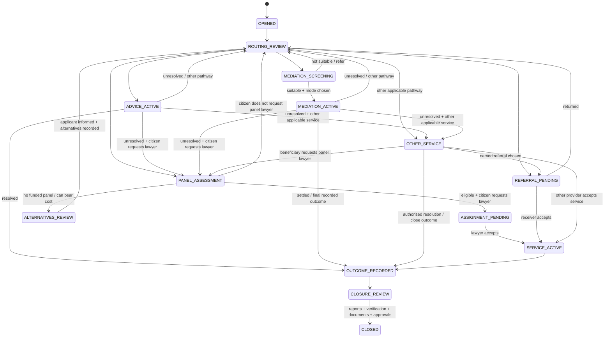

### 9.3 Promise

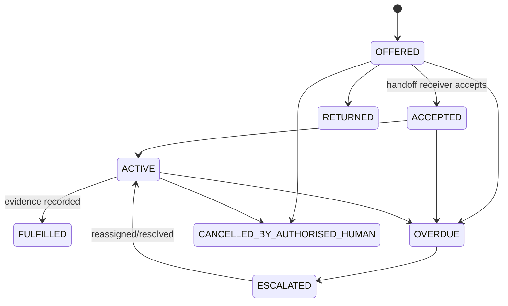

`DUTY` promises can begin as `ACTIVE`. `CITIZEN_OWED` promises use reminders and `UNREACHABLE`, never `REFUSED` unless the citizen expressly refuses and a human records it.

### 9.4 Referral responsibility

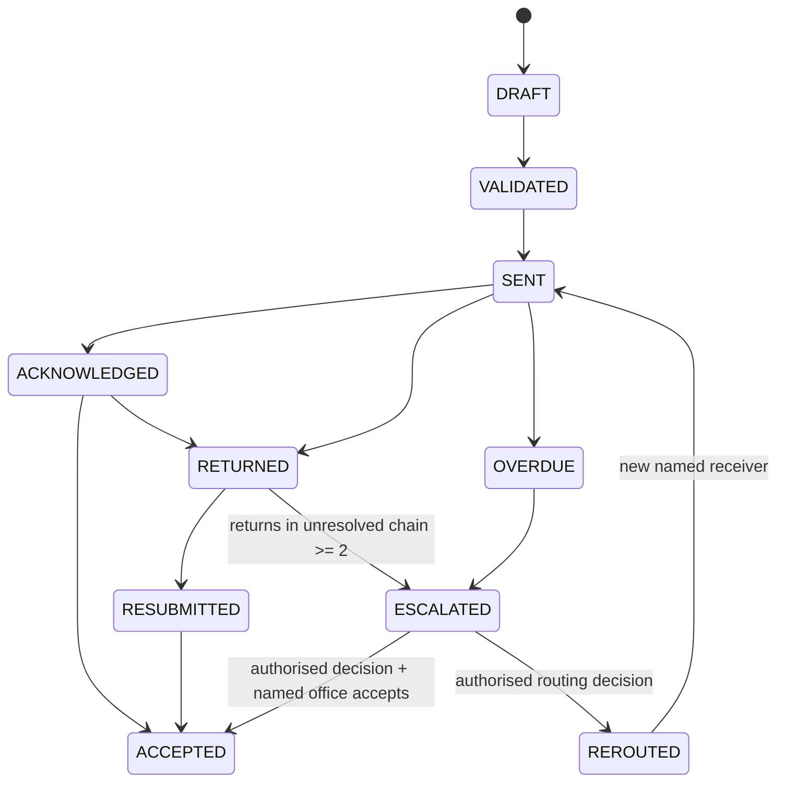

The sender owns the case while `SENT`, `ACKNOWLEDGED`, `RETURNED`, `RESUBMITTED`, `OVERDUE`, `ESCALATED` or `REROUTED`. Ownership changes only when a named receiving office reaches `ACCEPTED`. An escalation cannot be closed by recording “reviewed”; it must produce a route decision and receiver acceptance or remain visible.

The ADLASB prototype setting is `referral_return_threshold = 2`. It counts returned/rejected transfers within the same unresolved transfer chain, regardless of interleaved resubmission or acknowledgement. It is stored in `PolicyPackVersion` for provenance and effective-date traceability, but the prototype must not silently raise it; a change requires an authorised higher-document/policy update. Acceptance by a named receiver completes that transfer chain; the full transfer history remains auditable.

### 9.5 Interim and final payment-stage reconciliation

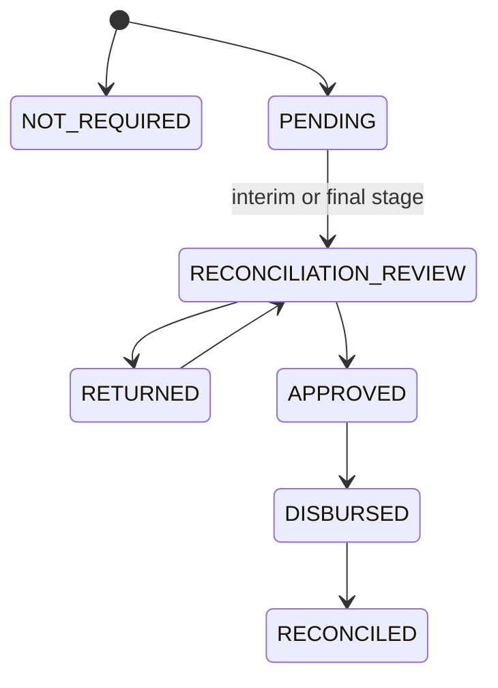

`PaymentStage` is a stage-level record, not a single after-closure case status. An interim stage can be reconciled when a lawyer changes before closure (T1); completion/final stages may continue after closure. The case stores a derived summary only. Payment never blocks case closure, and the composite state `CLOSED · PAYMENT_PENDING` remains valid.

### 9.6 Grievance lifecycle

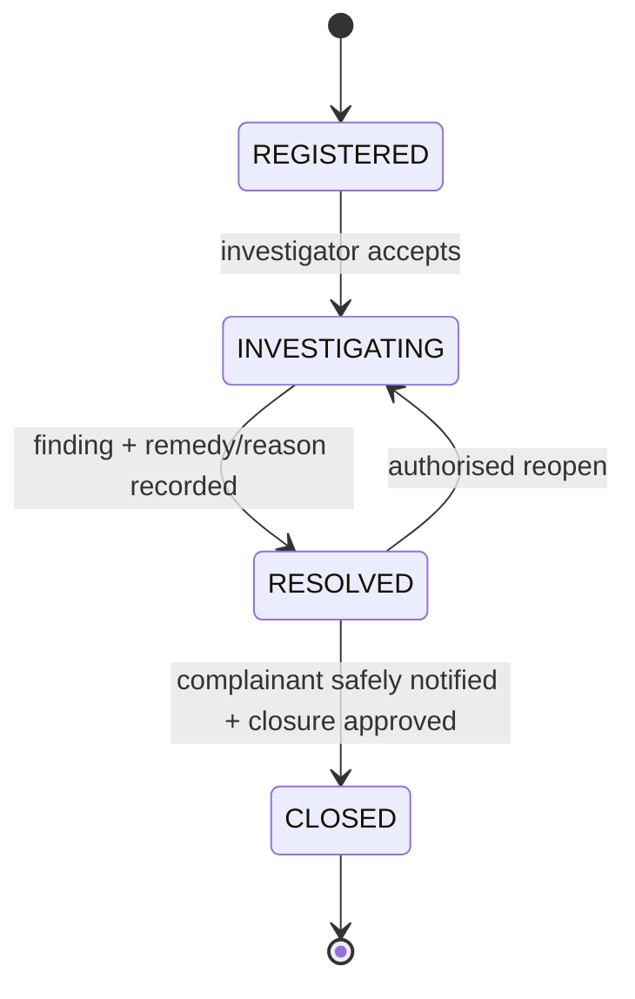

A grievance does not mutate the underlying case/provider history. Resolution cites evidence, responsible investigator and any resulting promise or referral. Categories include “asked for payment” and “lawyer not responding.” Notification uses the same safe-contact/outbox rules.

### 9.7 Appeal review lifecycle

`FILED -> UNDER_REVIEW -> DECIDED_APPROVED | DECIDED_REJECTED -> NOTIFIED`

Only the configured District Legal Aid Committee/competent authority may decide. `DECIDED_APPROVED` drives the existing authorised application transition from `APPEAL_PENDING` to `ACCEPTED`; rejection reaches `CLOSED_REJECTED` only after reason, next-step guidance and notification are recorded.

---

## 10. Case Ledger, Vault and integrity verification

### 10.1 Per-aggregate chain

Each application/case has its own monotonically sequenced event chain:

```text
event_hash = SHA-256(
  canonical_json({
    aggregate_id,
    aggregate_sequence,
    event_type,
    server_timestamp,
    actor_id,
    role,
    office_id,
    channel,
    authority_basis,
    before_ref,
    after_ref,
    payload_commitment,
    previous_event_hash
  })
)
```

Canonical JSON has stable key order, UTF-8 encoding, normalized timestamps and no floating-point ambiguity. Mutable database IDs, free-form PII and delivery timestamps are excluded from the signed body unless intentionally represented by a later event.

For a vault-backed value, `payload_commitment` is not a raw hash:

```text
payload_commitment = HMAC-SHA-256(
  random_256_bit_payload_key,
  canonical_payload
)
```

The random per-payload key is encrypted inside the vault boundary and never stored in the ledger. This prevents dictionary/linkage attacks against low-entropy names, phone numbers and identifiers. Non-sensitive system payloads may use a plain content hash only when their classification explicitly allows it.

### 10.2 Vault separation and withdrawal

The ledger contains `payload_id`, classification and an opaque keyed commitment—not sensitive plaintext or a brute-forceable raw hash. The encrypted vault payload and its random HMAC key are separately authorised.

Withdrawal sequence:

1. authorised actor validates the withdrawal request and scope;
2. vault payload becomes masked or is cryptographically/deletion-policy removed, and its per-payload HMAC key is destroyed;
3. operational projections no longer expose it;
4. a `STATEMENT_WITHDRAWN` event records payload ID/opaque commitment, authority, actor and time without repeating the content;
5. the event chain remains verifiable.

An auditor can see that information was withdrawn, not retrieve content that policy requires hidden or removed. After HMAC-key destruction, the historical event chain remains verifiable, but the withdrawn payload commitment can no longer be recomputed from plaintext; this is intentional cryptographic unlinkability, not an integrity error.

### 10.3 Checkpoints

A checkpoint records the latest `(aggregate_id, sequence, event_hash)` set for a tenant/scenario and a deterministic root over that set. The application signs the root with an ECDSA P-256 checkpoint key kept in the host secret store, outside PostgreSQL; only its public key is shipped with the independent verifier. The verifier is a separately built static client-side page/script. It accepts only an exported event/signature bundle and public key, makes no Shakkho API calls, reads no application state or database, recomputes every event/document hash and chain/root, then validates the checkpoint/signature. Reusing an in-app S28/S34 verification component does not satisfy independence.

This is independent of the database, not independent of the application host/operator: compromise of both the event store and checkpoint signing key could forge a new history. A production design should anchor signed checkpoints to a separately governed service. The 23/23 navigator displays the prototype verification result. The Failure Lab's “tamper row” action operates only on seeded demo data and proves detection; it is disabled in production mode.

### 10.4 Threat-model statement

The ledger detects accidental duplication, stale/conflicting writes and later database-row modification within the demonstrated trust boundary. It assumes the host checkpoint key and verifier artefact are not compromised together. It does not prevent every privileged attack, does not prove the truth of an entered fact and must never be called tamper-proof.

---

## 11. Promise Engine and virtual time

### 11.1 Promise types

| Type | Creation | Completion | Failure behavior |
|---|---|---|---|
| `HANDOFF` | Referral or assignment offered | Receiver accepts and required package is available | Sender stays owner; overdue/return escalates |
| `DUTY` | A role owes an update, review, notice or document | Required evidence is cited | Becomes overdue and enters escalation ladder |
| `CITIZEN_OWED` | Citizen may provide information/document | Item received or authorised human closes/cancels | Reminder only; unreachable is not refusal |

### 11.2 Escalation ladder

`owner -> supervisor -> programme/DBLA oversight`

Each rung creates a new event and notification. The final unresolved rung remains visible. Escalation is never treated as completion.

### 11.3 Scheduler

The scheduler reads `effective_now(tenant_id)`:

- production mode returns server time;
- demo mode returns the tenant virtual clock;
- tests use a deterministic injected clock.

Time Machine controls are `+1h`, `+24h`, `+48h`, `jump to next due` and `reset`. A clock jump appends `DEMO_CLOCK_ADVANCED`; it does not modify wall-clock time or backdate legal events.

---

## 12. Human Decision Gate

### 12.1 Decision request shape

```ts
type DecisionRequest = {
  decisionType: DecisionType;
  aggregateId: string;
  evidenceRefs: string[];
  missingFacts: string[];
  recommendation?: {
    outcome: string;
    reasonCodes: string[];
    policyVersion: string;
    generatedBy: "RULE" | "AI_ASSIST";
  };
  allowedOutcomes: string[];
  requiredRole: Role[];
  reasonRequired: boolean;
};
```

The UI renders evidence and uncertainty before the recommendation. High-stakes acceptance, rejection and every override require a human reason. The recorded decision includes the exact evidence set and policy version seen by the person.

### 12.2 Role-authority matrix

| Decision | Allowed role |
|---|---|
| Eligibility accept/reject/request information | DLAO/Legal Aid Officer or configured authorised office role |
| Priority and response target | DLAO/Legal Aid Officer |
| Consequential route/referral | Authorised DLAO/SCLAC/LLAC officer |
| Mediation suitability and mode | Legal Aid Officer/Mediator |
| Panel assignment/reassignment | DLAO/authorised panel manager |
| Operational escalation | Supervisor/escalation authority |
| Appeal | District Legal Aid Committee/competent authority |
| Payment approval/disbursement | Finance/accounts reviewer |
| Closure | Authorised DLAO/Legal Aid Officer |

System administrator changes configuration but cannot inherit case-decision authority. Auditor is read-only. Case-support staff cannot approve legal decisions.

### 12.3 Automation-bias controls

- evidence appears before recommendation;
- uncertainty and missing data are explicit;
- acceptance and override reasons are captured;
- decision time and override rate are measured;
- sampled audit view compares evidence, recommendation and human result;
- no ranking is presented as a probability of legal success.

---

## 13. Status Sentence, travel advice and safe contact

### 13.1 Template engine

Citizen-visible text is selected from versioned, approved Bangla/English templates with typed slots:

```text
STATUS.AWAITING_OFFICER_REVIEW(next_date)
STATUS.REFERRAL_WAITING(receiver_label, acknowledgement_due)
STATUS.LAWYER_UPDATE_OVERDUE(callback_option)
STATUS.TRAVEL_REQUIRED(date, place, source_label)
STATUS.TRAVEL_UNKNOWN(contact_option)
```

Free-form narrative, dispute category, opposing party and safety facts cannot enter a template unless that template and channel explicitly allow them. The LLM never writes this text.

### 13.2 Travel advisory

| State | Rule |
|---|---|
| `TRAVEL_REQUIRED` | Requires date, place and verified source |
| `NO_TRAVEL_NEEDED` | Requires human-verified basis and validity window; forbidden for court hearing dates |
| `UNKNOWN` | Default; directs the citizen to a safe contact route |

### 13.3 Safe-contact evaluation

Before OTP, notification, call script or status disclosure:

1. resolve the intended person and contact point;
2. load channel safety, quiet hours and allowed wording;
3. require safe phrase/verification level appropriate to disclosure;
4. either create the neutral outbox message or record `SUPPRESSED_UNSAFE_CHANNEL`;
5. if suppressed, create the responsible human fallback promise.

The UI uses a neutral app name/icon and includes quick exit. The system must not silently substitute a UDC or shop number as the citizen's personal number.

### 13.4 Bangla SMS variants

Bangla SMS uses Unicode encoding and typically fits about 70 characters in one segment (fewer per segment when concatenated). Every SMS-capable Status Sentence therefore has a separately approved `SHORT_BN` template designed for one segment, plus a neutral multi-segment fallback only when the safety policy permits it. The composer counts encoded characters/segments before queueing, displays the predicted segment count in the simulator and never truncates a date, reference or callback instruction. Case type, opposing party and sensitive facts remain forbidden even if space is available.

---

## 14. Five access doors

| Door | Client behavior | Server behavior | Prototype boundary |
|---|---|---|---|
| Web/mobile PWA | Bangla-first form, save/resume, screen reader, offline queue | Same application commands and IDs | Fully working |
| 16699/IVR/voice | Numeric reference, safe phrase, audio status/OTP, agent-assisted intake | Permitted-disclosure projection and intake commands | Telephony transport simulated; state real |
| USSD/SMS | Short keypad menu and neutral Status Sentence | Safe template/outbox and suppression event | Gateway simulated; state real |
| UDC/assisted | Free-service notice, provenance, read-back consent, expiring access | Assistant scope, `VERBAL_READBACK`, audit and offline sync | Fully working assisted view |
| DLAO/institution/focal point | Walk-in/referral intake and provider actions | Same application/case aggregate | Fully working |

All doors call the same commands. No door owns a separate citizen or case database.

### 14.1 Accessibility contract

- Bangla is default; English toggle changes the complete interface.
- TalkBack flow completes the same meaningful task as the visual route.
- Audio OTP has repeat and generous timeout.
- No CAPTCHA, visual-only OTP or PDF-only task.
- IVR has USSD/SMS/web-text equivalent for Deaf or hard-of-hearing users.
- Logical focus, labelled controls, minimum target size and 200% zoom/reflow are release gates.
- Pre-generated Bangla audio is the deterministic prototype path.
- Citizen, UDC and lawyer views use the approved legible Bangla sans token; colours and fonts come only from design tokens.

### 14.2 T10 normal/light rendering-mode contract

The PWA exposes a persistent manual **Normal / Light** toggle on every access route. On first visit it may recommend or select Light mode when `Save-Data` is exposed, but the user can always override it. The chosen mode is stored as a non-sensitive preference. Missing browser hints default to Normal; the application must not infer poverty, disability or case priority from the mode.

Light mode uses the same routes, validation, security and task semantics while it:

- removes decorative/stock imagery, background textures and non-essential icons;
- disables animation and non-essential transitions;
- uses system or preloaded subset Bangla fonts instead of downloading the full display family;
- prevents route/data prefetch beyond the next required step;
- loads document thumbnails/previews only on explicit request;
- replaces charts with compact values/tables;
- reduces polling and defers non-critical dashboard panels;
- keeps all labels, errors, focus order, read-back, quick exit, Status Sentence and offline controls.

It must never strip safety warnings, consent, provenance, human-decision evidence or failure recovery. Server responses honour a signed/session rendering preference only for optional payloads; authorisation and field disclosure remain role-based.

#### Repeatable normal-versus-light harness

Run both modes against the same seeded primary task, build, browser/device profile and cold cache:

1. Chrome DevTools Slow 3G and 4× CPU slowdown, with one clean profile per run;
2. reset the same visitor tenant and service worker before each mode;
3. run the task three times per mode and report the median;
4. capture transferred KB, request count, first meaningful paint, time to interactive, task-completion seconds and taps;
5. store the JSON result with commit/build ID and expose a two-row comparison in T10 `/selftest`;
6. repeat once on the selected low-end Android device before release.

Day-1 measurements establish the versioned prototype budget; a later build that regresses Light-mode transferred bytes or task time by more than 10% fails the T10 gate unless the change is documented and approved. Results are prototype engineering measurements, not population impact.

---

## 15. Offline architecture and sync protocol

### 15.1 Local storage boundary

Cache:

- application shell and static assets;
- minimal approved reference data;
- explicitly queued drafts/events;
- temp-to-server ID mappings needed for retry.

Do not cache by default:

- browsed case pages;
- sensitive evidence files;
- unrestricted status history;
- authentication tokens in persistent JavaScript storage;
- another operator's data.

Queued payloads are encrypted using AES-GCM. The key is PBKDF2-derived from an operator-entered PIN/passphrase plus random salt, retained in memory only. Logout/reset drops the key and wipes queue, decrypted working copies and sensitive caches. The prototype states that short-PIN entropy is a limitation; production requires approved authentication and key management.

Sync is deliberately **foreground-only**. The service worker may cache the shell but cannot decrypt or submit the queue after the in-memory key disappears, and the architecture does not depend on Background Sync support on iOS. The UI shows the pending count and tells the operator to keep/reopen Shakkho to sync.

If the server session expires while offline, the encrypted queue remains locked and intact. On reconnect, the operator must re-authenticate, re-enter the queue PIN and then explicitly resume sync. Re-authentication never changes the offline UUIDs or creates a second submission.

There is no recovery backdoor for a forgotten queue PIN. After an explicit warning and confirmation, the operator may discard the undecryptable local queue and start again; already-synced server records remain. The receipt displays this limitation before offline capture, and the application never silently deletes a pending queue.

### 15.2 Offline event envelope

```ts
type OfflineEvent = {
  offlineUuid: string;
  tempId: string;
  deviceId: string;
  localSequence: number;
  commandType: string;
  encryptedPayload: string;
  encryptedPayloadHash: string;
  lastKnownServerAnchor?: string;
  deviceTime: string;
};
```

Device time is informative and untrusted. The server receipt time and canonical sequence define authoritative order.

### 15.3 Sync sequence

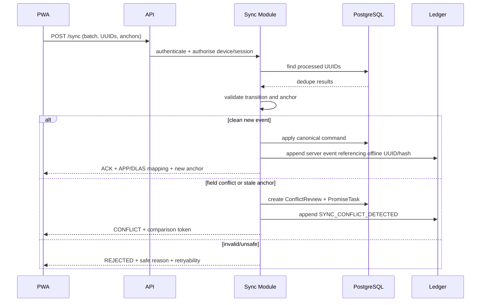

The client never inserts directly into `AuditEvent`. A stale anchor is not silently discarded. Per-field conflict rules identify non-overlapping changes; competing material claims always go to authorised human review.

### 15.4 Retry and quota behavior

- exponential retry with capped backoff and manual retry;
- idempotency by offline UUID/command ID;
- visible `PENDING_SYNC`, `SYNCED`, `CONFLICT`, `FAILED_RETRYABLE` states;
- quota pre-check and safe warning before accepting large evidence offline;
- no silent eviction of pending drafts;
- `TEMP` receipt remains usable until server mapping is returned.

The offline threat model covers loss of connectivity and accidental/stale edits, not a fully compromised unlocked device. Foreground sync, queue PIN loss and expired-session recovery are explicit acceptance cases.

---

## 16. Documents, OCR, AI and drafting

### 16.1 Document pipeline

```text
upload/capture
→ client quality check (size/blur)
→ private object store
→ SHA-256 metadata record
→ document-type classification
→ OCR with page/region spans
→ checklist/latest-version/duplicate comparison
→ source-anchored briefing
→ human verification
```

Every material briefing sentence must cite an OCR span/page-region or it is dropped. Unreadable areas remain `UNREADABLE/UNCERTAIN`; the system never invents their content. Sensitive media can disable thumbnail generation and require reasoned break-glass viewing.

### 16.2 AI adapter contract

All AI calls are server-side. Before a call:

- mask names, phone numbers, NID and direct identifiers;
- attach only minimum required context;
- select a versioned prompt/tool schema;
- mark user-provided text as untrusted data;
- reject tool invocations not on the allowlist;
- set timeout, rate limit and deterministic fallback.

The public deployment also maintains an atomic **global daily AI spend/token budget** in addition to per-tenant and per-endpoint rate limits. Crossing 80% emits an operator warning; crossing 100% opens the circuit breaker and routes every T5–T8 request to deterministic rules/fixtures until an authorised operator resets the budget window. A request race cannot exceed the cap silently because reservation happens before the provider call. The UI labels fallback mode without blocking the legal-aid workflow.

Allowed T5 tools are bounded operations such as `get_required_documents`, `check_published_criteria` and `find_office`. Model output must validate against the exact JSON schema before use. It cannot mutate state directly; a domain command or human decision must consume it.

### 16.3 AI capability boundaries

| Capability | AI may do | Human must do |
|---|---|---|
| T5 intake | extract approved slots, clarify, summarise uncertainty | confirm facts; handle sensitive/ambiguous handoff |
| T6 documents | classify, OCR, source-anchor briefing, flag missing/unreadable | verify briefing and evidence sufficiency |
| T7 settlement | draft from approved template, mark inference, run consistency checks | legal review, party read-back/consent and version lock |
| T8 triage | produce fixed-schema category/urgency/process suggestions | decide priority and route; resolve disagreement |
| Status Sentence | no free-form generation | approve sensitive/hearing status; templates handle routine status |

Deterministic rules sit beneath every demonstration so model latency or outage does not break acceptance.

---

## 17. Mediation, referral and lawyer mechanics

### 17.1 Mediation safety gate

Before scheduling, the mediator reviews coercion, violence and power-imbalance evidence and records one outcome:

- `PROCEED`;
- `SEPARATE_SESSIONS`;
- `REMOTE`;
- `NOT_SUITABLE`;
- `REFER`.

Flagged matters never auto-schedule a joint session. Each party has a separate participation mode, notice-delivery state, remote consent, identity/join check and attendance record. Failed ODR creates a real reschedule/in-person fallback promise; only the video connection may be simulated.

### 17.2 Referral package

A package contains only:

- referral reason and requested action;
- minimum case history;
- required document manifest and hashes;
- sensitive-access restrictions;
- sender/receiver and acknowledgement deadline;
- applicable structured return reasons.

The completeness validator blocks a required-field omission but does not treat a disputed or unavailable document as present. Nabila's restricted media travels by reference and permission, not copied into unrestricted messages.

### 17.3 Lawyer assignment and continuity

Assignment uses a human-reviewed panel snapshot: approval, practice area, workload and conflict check. Lawyer acceptance/decline is explicit. Reassignment creates:

- outgoing handover checklist;
- latest-version document package;
- hearing/deadline transfer;
- urgent coverage promise if a hearing is within the configured illustrative threshold;
- stage reconciliation evidence;
- safe citizen notification after verification.

Pattern alerts are labelled **review**, not misconduct. The system never computes an automatic recoverable amount.

---

## 18. Notification and external adapters

### 18.1 Transactional outbox

Domain transactions insert `NotificationOutbox`; they never call an external gateway before commit.

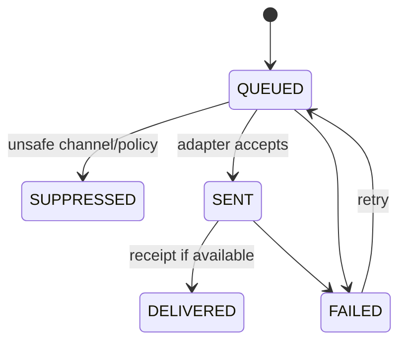

`SENT` is not `DELIVERED`. When a delivery receipt is unavailable, the UI says so rather than inventing delivery.

### 18.2 Adapter interface

```ts
interface IntegrationAdapter<Input, Result> {
  readonly name: string;
  readonly mode: "REAL" | "SIMULATED";
  health(): Promise<AdapterHealth>;
  validate(input: Input): ValidationResult;
  execute(input: Input, idempotencyKey: string): Promise<Result>;
}
```

The integrations panel publishes contract, mode, last health result and known limitations for 16699, SMS, email, payment, NID and court sources.

---

## 19. Authentication, authorisation and privacy

### 19.1 Authentication paths

- Staff/provider prototype accounts use role-bound sign-in; production requires approved identity and MFA.
- Citizen web uses safe OTP only when the channel is allowed.
- Alternatives are voice OTP, assisted verification or in-person verification.
- IVR/USSD uses numeric reference plus PIN/safe phrase and disclosure level.
- No CAPTCHA or visual-only authentication step.

The current frontend's role portals are entry points, not proof of authorisation. The server session owns role and scope.

### 19.2 Authorisation dimensions

Access requires all applicable checks:

```text
tenant scope
AND authenticated role
AND office scope
AND case assignment/relationship
AND action permission
AND data classification permission
AND purpose/break-glass requirement
```

Child/GBV/coercion and restricted evidence can impose tighter field/document rules than the case itself.

### 19.3 Break-glass

For the five-day prototype, break-glass exists only for Nabila's seeded restricted-evidence scenario. It requires an eligible role, selected purpose, free-text justification and re-authentication where feasible. It writes an access event and enters the auditor/supervisor review queue. It grants only time-limited read access, never decision authority. Other sensitive records use ordinary case/office assignment checks; broader break-glass coverage is a production extension.

### 19.4 Security controls

- HTTPS and secure, HTTP-only, same-site session cookies;
- CSRF protection for browser mutations;
- server-side schema validation and parameterised database access;
- content-type, size and malware checks for uploads in production;
- private object-store URLs with short-lived access;
- secrets only in managed environment configuration;
- no PII, safe phrase, OTP or document text in application logs;
- rate limits on public, OTP, sync and AI endpoints without CAPTCHA;
- session timeout and shared-device logout wipe;
- dependency, secret and static-analysis checks before deployment.

---

## 20. API surface

The exact routes may change, but these resource/command boundaries are stable:

| Area | Example endpoints |
|---|---|
| Sessions | `POST /api/sessions/otp/request`, `/verify`, `/safe-phrase/verify`, `/logout` |
| Applications | `POST /api/applications`, `POST /submit`, `GET /receipt`, `POST /withdraw-claim` |
| Cases | `GET /api/cases/:id`, `POST /route`, `/close`, `GET /status-sentence` |
| Decisions | `POST /api/decisions/:type`, `GET /api/decision-queue` |
| Promises | `POST /api/promises/:id/accept`, `/complete`, `/cancel`; `GET /api/my-promises` |
| Referrals | `POST /api/referrals`, `/:id/accept`, `/:id/return`, `/:id/acknowledge` |
| Appeals/grievances | `POST /api/applications/:id/appeals`, `/api/appeals/:id/decide`; `POST /api/grievances`, `/:id/investigate`, `/resolve`, `/close` |
| Mediation | `POST /api/mediation/screen`, `/attempts`, `/outcome` |
| Lawyers | `POST /api/assignments`, `/:id/respond`, `/updates`, `/reassign` |
| Documents | `POST /api/documents`, `/versions`, `/analyse`, `GET /:id/access` |
| Offline | `POST /api/sync`, `POST /api/conflicts/:id/resolve` |
| Notifications | `GET /api/notifications`, `POST /api/simulators/sms`, `/ussd`, `/ivr` |
| Integrity | `GET /api/ledger/:aggregate/verify`, `/checkpoint`; demo-only `/tamper` |
| Demo/test | `POST /api/demo/reset`, `/clock/advance`, `/scenario/:id`; `GET /selftest` |

Every mutation accepts `Idempotency-Key` and `If-Match`/expected version. Errors use stable codes such as `UNAUTHORISED_ROLE`, `STALE_VERSION`, `UNSAFE_CHANNEL`, `HUMAN_DECISION_REQUIRED`, `PACKAGE_INCOMPLETE`, `SYNC_CONFLICT` and `INVALID_TRANSITION` with Bangla and English presentation strings.

---

## 21. Reporting and prototype measurements

Reports are derived from canonical events and promises, not manually maintained totals.

| Measurement | Event calculation |
|---|---|
| Owned-next-action rate | Active cases with accepted/active due promise ÷ all active seeded cases |
| Handoff acknowledgement time | Median `ReferralAccepted/Returned - ReferralSent` |
| Prevented unnecessary journey rate | Verified `NO_TRAVEL_NEEDED` delivered before planned journey ÷ seeded planned journeys |
| Continuity rate | Cross-channel/provider transitions retaining one ID ÷ all seeded transitions |
| Timely intervention rate | Overdue promises resolved before recorded failure/closure ÷ overdue seeded promises |

The UI labels these **prototype measurements from seeded data** and exposes numerator, denominator and event IDs. District and management views use the same event vocabulary and display filter/freshness metadata.

---

## 22. Multi-district and 64-district scaling

### 22.1 Stable national core

Keep stable:

- IDs and aggregate model;
- event and promise vocabulary;
- role and decision model;
- security, safe-contact and provenance rules;
- API contracts;
- reporting formulas;
- accessibility behavior.

Configure by effective version:

- office/service directory and referral focal points;
- district/office scope;
- policy applicability, date and geography;
- panel lawyers and workload;
- mediation availability/modes;
- templates and knowledge articles;
- escalation/SLA thresholds;
- language and accessibility assistance.

### 22.2 Database scaling path

1. Prototype: indexed PostgreSQL with tenant/office/case keys.
2. Pilot: managed backups, point-in-time recovery, connection pooling and read-only reporting replica.
3. National: partition high-volume events/access logs by time or district only after measurement; keep Case ID global and referrals cross-partition-safe.
4. Separate outbox/document-analysis workers when queue depth requires it.

No district receives a forked schema or codebase.

### 22.3 Resilience targets for the prototype

- deterministic tenant reset;
- clean-browser install and offline reopen;
- no duplicate after retry;
- clear degraded mode when AI/OCR/integration is unavailable;
- health endpoint covering app/database/outbox and adapter status;
- local Docker and recorded MP4 fallback;
- always-on public host to avoid live cold starts.

Production service levels, recovery objectives and data retention must be approved by DBLA/government stakeholders; the prototype does not invent them.

---

## 23. Observability and accountability

### 23.1 Technical telemetry

- request latency/error rate by route, never by citizen name;
- database transaction/conflict rate;
- outbox queue depth, delivery failures and retry count;
- scheduler lag and overdue promise count;
- sync batch success, duplicate and conflict count;
- AI/OCR latency, schema failures and deterministic fallbacks;
- PWA page weight, requests, first meaningful paint, interactive time and task completion.

### 23.2 Accountability telemetry

- decision type, actor role, authority and reason presence;
- handoff sent/acknowledged/accepted durations;
- unresolved final escalation rungs;
- safe-contact suppression and fallback completion;
- break-glass usage and review result;
- recommendation acceptance/override pattern and decision time;
- ledger/checkpoint verification status.

Operational logs and accountable audit events are separate. Log retention must not become a shadow PII database.

---

## 24. Failure model

| Failure | System behavior | Human owner |
|---|---|---|
| Unsafe person answers | Suppress disclosure, record reason, retain unconfirmed state, schedule safer route | 16699 agent/DLAO |
| OTP channel unsafe | Do not send; offer voice/assisted/in-person verification | Intake agent/DLAO |
| Referral unacknowledged | Sender remains owner; promise overdue; alternate-channel escalation | Sending officer then supervisor |
| Two or more returns | Retain escalation with chain/time-in-limbo | Supervisor |
| Network loss | Encrypted draft and temp receipt remain; retry sync | UDC/operator, then conflict reviewer |
| Concurrent offline edits | No last-write-wins; create field comparison | Authorised officer |
| Unreadable document | Mark uncertainty and missing item; no fabricated briefing | Verifying officer |
| AI unavailable/invalid | Deterministic rule/fixture fallback; record degraded mode | Relevant human reviewer |
| Lawyer misses updates | Reminder then DLAO review; no automatic misconduct finding | DLAO/supervisor |
| Reassignment before hearing | Urgent coverage and handover promises | DLAO/outgoing lawyer |
| ODR fails | Reschedule/in-person fallback promise | Mediator |
| Notification fails | Retry/alternate route; `FAILED` remains visible | Promise owner |
| Signed document changes | Verification fails; document requires re-review/re-signing | Mediator/parties |
| Shared-device logout | Key discarded; queue and sensitive caches wiped | System-enforced |
| Officer never acts | Escalate to supervisor then oversight; final rung remains visible | Oversight role |

---

## 25. Testing and conformance architecture

### 25.1 Five-day prototype test set

- **`/selftest`:** the primary regression suite for A1–A5, B1–B7 and T1–T11, including state/event/promise assertions.
- **Focused domain tests:** allowed state-machine edges, authority matrix, idempotency, HMAC/chain verification, safe templates and closure/payment independence.
- **Playwright path 1:** Moyuri/Ripon safe contact, screen-reader semantics, safe OTP and withdrawal.
- **Playwright path 2:** Nuching offline capture, expired-session re-authentication, temp-ID sync, conflict and logout wipe.
- **Playwright path 3:** Nabila/Rahim referral non-acknowledgement, virtual time, two-return escalation and authorised reroute.
- **Playwright path 4:** Malek/Marzina missed updates, reassignment/coverage and interim payment reconciliation.
- **Playwright path 5:** mediation safety, T7 version lock and independent T11 mutation failure.
- **Independent verifier:** a separately built static client-side page/script accepts only the exported artefact and public key, makes no Shakkho API calls, reads no application state or database, recomputes the event/document hashes and verifies the signature. Embedding the same verifier component in S28/S34 does not satisfy this test.

Broad API-contract, exhaustive integration and security suites are production work. The prototype still validates every schema at runtime and must not mark an item PASS from UI presence alone.

### 25.2 `/selftest`

`/selftest` creates a fresh tenant and runs all 23 scenarios plus explicit suites for the five access doors (including neutral USSD/SMS), G1–G10, rejection and applicable appeal, both financial-status branches, and closure blocking when reports, verification, documents or approvals are incomplete. It reports:

- PASS/FAIL;
- starting and final aggregate state;
- created event IDs;
- expected promise/decision/outbox records;
- integrity result;
- reset control.

It must not mark an item PASS merely because a screen exists. PASS requires the specified state transition and audit evidence.

### 25.3 First-order risk gates

Before dependent work:

1. test Bangla OCR on text PDF, scan and phone photo;
2. test Bangla TalkBack, pre-generated audio and voice OTP on real Android hardware;
3. containerise and deploy the minimal PWA/API to one always-on Fly Machine in `sin` with autostop disabled; verify clean-browser service-worker install/offline reopen;
4. run the in-process scheduler/outbox with no incoming requests and prove the virtual clock makes a promise overdue and processes its outbox record;
5. prove offline event-to-server chain joining and temp-ID mapping;
6. prove withdrawal destroys the payload HMAC key, hides vault content and preserves event-chain verification;
7. exercise foreground-only sync after an expired session and the forgotten-PIN discard warning;
8. run the normal/light T10 harness under the identical throttled profile.
9. load-test at least 25 concurrent visitor tenants across seed, reset and representative writes; publish p95 latency, seed/reset time and error rate, and configure the cap from the result rather than assuming 200-tenant capacity.

---

## 26. Six implementation slices

Shared foundation—schema, RBAC, ledger/vault, Promise Engine, Human Decision Gate, Time Machine, visitor reset and outbox—is built once.

| Slice | End-to-end path | Mandatory items |
|---|---|---|
| 1. Safe accessible intake | Moyuri/Ripon -> 16699/web -> representation, safe contact, T5 handoff/status | A1, A2, B3, T5 |
| 2. Assisted offline intake | Nuching -> UDC -> T6 document check -> T9 sync -> T10 PWA | A4, B4, T6, T9, T10 |
| 3. DLAO operations | queue -> related cases -> duplicate review -> triage disagreement -> routine report | B1, B7, T3, T4, T8 |
| 4. Mediation and settlement | safety -> attempts/ODR -> three T7 drafts -> T11 signature -> outcome | B2, T7, T11 |
| 5. Urgent referral | Nabila package -> receiver non-ack -> Rahim two-return escalation | A3, B6, T2 |
| 6. Lawyer accountability | Malek status -> Marzina reassignment -> handover/coverage -> payment reconciliation | A5, B5, T1 |

Each slice is complete only when its citizen/provider action changes canonical state, creates the appropriate event/promise and appears in the 23/23 navigator.

---

## 27. Repository target structure

The existing `frontend/` remains the Next.js application. Build toward these boundaries without duplicating domain logic inside pages:

```text
frontend/
  app/
    (public)/                 # citizen, status and safe session routes
    (provider)/               # DLAO, mediator, lawyer, admin/auditor views
    api/                      # thin route handlers
    selftest/                 # protected/public-demo test report
  components/                # accessible presentation components
  lib/
    auth/                     # session adapters and server guards
    contracts/                # command/query/event schemas
    domain/                   # modules below; no React imports
      applications/
      cases/
      decisions/
      ledger/
      vault/
      promises/
      referrals/
      mediation/
      lawyers/
      payments/
      notifications/
      policies/
      sync/
    adapters/                 # SMS, email, payment, NID, court, AI/OCR
    projections/              # role-scoped read models
    demo/                     # seeds, Time Machine and reset; disabled in production
  worker/                     # scheduler/outbox runner if separate process
  tests/
    domain/
    integration/
    e2e/
    scenarios/
  db/
    migrations/
    seeds/
docs/
  architecture/
    architecture.md
    reconciliation-rules.md
  PRD/PRD.md
  design/design.md
```

If a separate API service is introduced later, move domain/application modules behind the same OpenAPI and event contracts. Do not implement competing rules in both Next.js and another backend.

---

## 28. Architecture decision records

| ID | Decision | Reason | Revisit trigger |
|---|---|---|---|
| ADR-001 | Modular monolith for prototype | Atomic cross-module transactions and five-day feasibility | Proven load/team boundary requires extraction |
| ADR-002 | PostgreSQL is canonical state | Relational workflow, constraints, transactions and reporting | None expected for core records |
| ADR-003 | Per-application/per-case hash chains | Offline concurrency and scalable integrity | Independent authority mandates another anchoring model |
| ADR-004 | Vault payload and per-payload HMAC key outside chain | Withdrawal/privacy and unlinkability without destroying audit sequence | Approved retention/cryptographic-erasure policy changes |
| ADR-005 | Database outbox for external effects | Prevent state/delivery inconsistency | Queue scale exceeds DB worker capacity |
| ADR-006 | Template-only citizen status | Prevent leakage and hallucination | Never relax for LLM free text |
| ADR-007 | Server-canonical offline sync | One authoritative ordering and idempotency | CRDT requirement is formally justified per field |
| ADR-008 | ECDSA P-256 for T11 demo | Broad WebCrypto support | Approved government PKI dictates algorithm |
| ADR-009 | Virtual clock is tenant-scoped | Live juror-triggerable overdue behavior | Disabled outside demo/test |
| ADR-010 | Versioned policy/config packs | One national codebase with local/effective rules | Formal policy-distribution service becomes available |
| ADR-011 | One always-on Fly.io Machine in Singapore | Scheduler/outbox/virtual time must run without requests; avoids serverless sleep | Prototype load or availability requires multiple machines |
| ADR-012 | Normal/Light modes share semantics | Satisfies T10 without creating a second product or weakening safety | Device testing shows a different bounded optimisation is needed |
| ADR-013 | Signed checkpoint outside PostgreSQL | Independent exported-event verification detects database-only history rewrites | Separately governed national anchoring service becomes available |

---

## 29. Open implementation decisions

These remaining choices do not change the architecture but must be fixed before their module is coded:

1. PostgreSQL access layer/ORM and migration tool.
2. Managed PostgreSQL and private object-storage provider used by the Fly.io application.
3. Session provider for staff and citizen-safe OTP simulation.
4. Exact approved Bangla font token after the real-device weight/accessibility test.
5. Production retention and deletion policy for vault payloads and access logs.
6. Production identity-proofing and signing authority; prototype remains synthetic.
7. Which external adapter, if any, becomes real before submission. Default is clearly labelled simulation.

The application host and worker shape are **not open**: one continuously running Fly.io Machine in Singapore hosts the Next.js application and its in-process leased scheduler/outbox worker for the prototype.

No unresolved choice authorises automated eligibility, routing, mediation outcome, lawyer assignment, appeal, payment or closure.

---

## 30. Architecture completion gate

The architecture is implemented—not merely illustrated—when:

- all five access doors modify the same authoritative records;
- every A1–A5, B1–B7 and T1–T11 navigator action changes state and writes an event;
- role and office scope are enforced server-side;
- consequential transitions cannot bypass the Human Decision Gate;
- promises distinguish sent, accepted, fulfilled, overdue and escalated;
- unsafe contact and unsafe OTP are suppressed with a human fallback;
- withdrawal hides permitted vault content while chain verification remains valid;
- three offline records sync idempotently, one conflict reaches human review and temp IDs map correctly;
- mediation safety can prevent joint scheduling;
- referral sender ownership persists until acceptance;
- case closure works independently of post-closure payment;
- interim `PaymentStage` reconciliation works at lawyer reassignment before closure;
- Status Sentence and travel advice are template- and source-controlled;
- Bangla SMS selects a segment-aware short safe template;
- outbox distinguishes queued, sent, delivered, failed and suppressed;
- independent signature and ledger checks fail after mutation;
- vault-backed ledger events contain keyed commitments rather than brute-forceable raw PII hashes;
- signed checkpoints verify from an exported event bundle with a public verifier key;
- shared-device logout wipes decrypted/offline sensitive state;
- foreground sync survives session expiry through re-authentication and handles forgotten PIN without silent deletion;
- Normal and Light modes complete the same task and produce a repeatable same-profile T10 comparison;
- the global AI budget circuit breaker switches to deterministic fallback;
- demo tenants seed quickly, expire, garbage-collect and respect the active-tenant cap;
- the always-on in-process worker advances virtual-time promises without an incoming request;
- `/selftest` reports evidence-backed results for all 23 items;
- clean-browser PWA installation, offline reopen and reconnect pass on the public URL;
- all external simulators are visibly labelled and internal logic remains real;
- metrics are labelled as seeded prototype measurements rather than real-world impact.

This gate is the handoff contract between solution design and implementation.
